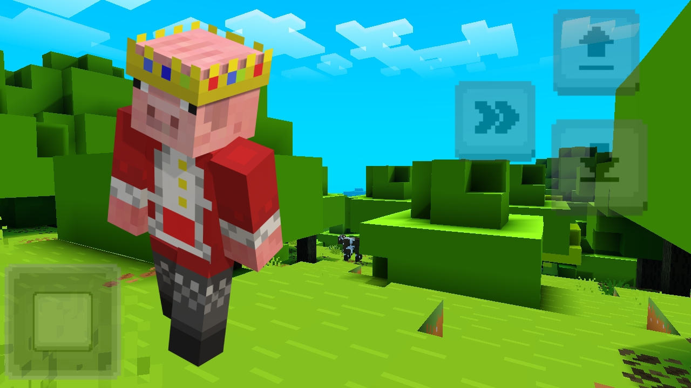
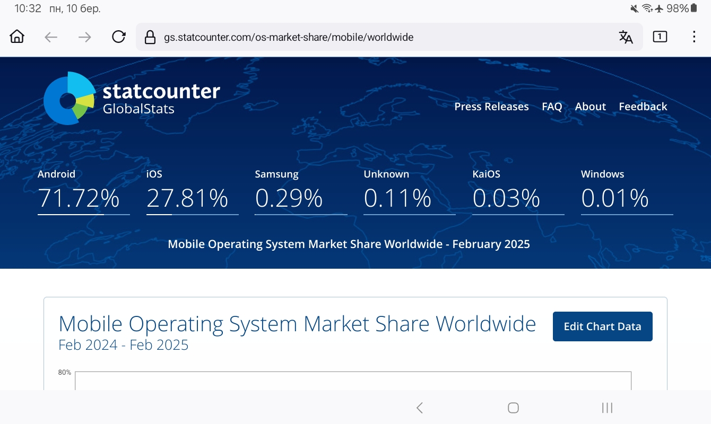
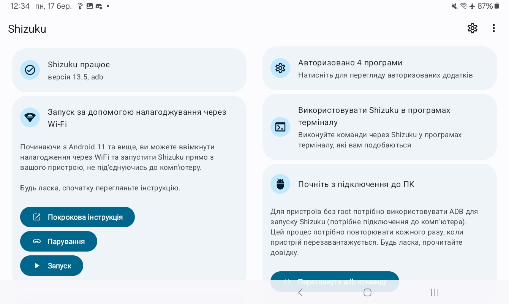
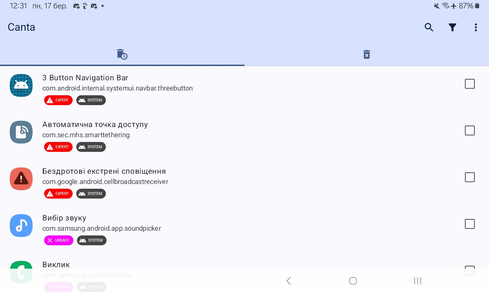
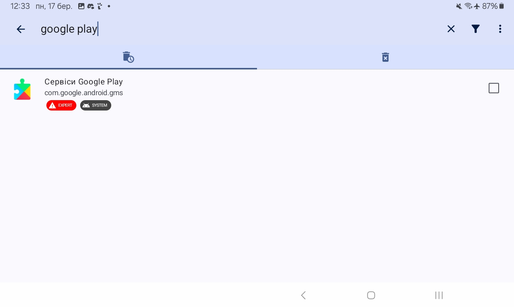
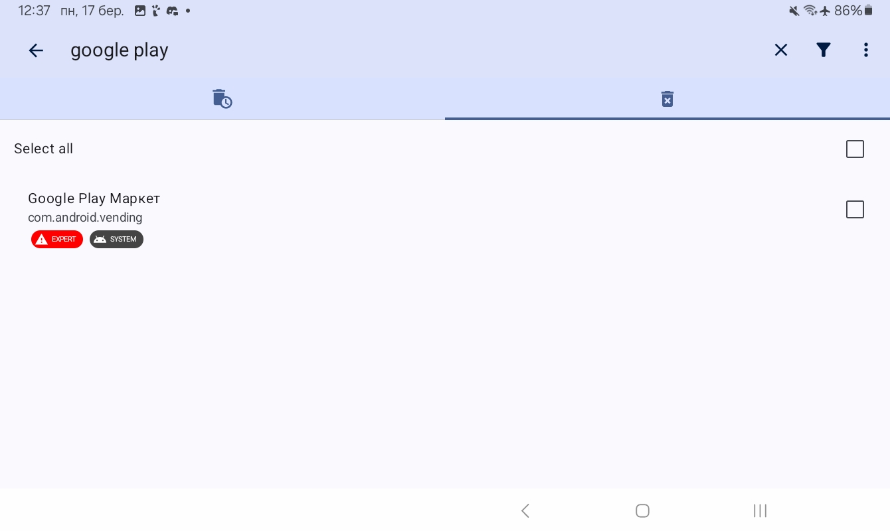

[04.08.2025](https://github.com/uzvarUA/04.08.2025/releases)
***
# Зміст по каналу
- [Мої канали](#мої-канали)
***
# Мої канали
| Odysee | YouTube |
|---|---|
| Це мій новий канал:[https://odysee.com/@uzvarua_minecraft:1](https://odysee.com/@uzvarua_minecraft:1) | Це мій старий канал:[https://www.youtube.com/@uzvar_ua](https://www.youtube.com/@uzvar_ua) |
***
# Роблю аудіокнигу про My Little Pony: Love за допомогою ffmpeg і ttsfree.com
1. [ttsfree.com](https://ttsfree.com/)
2. **FFmpeg у Termux:** <br><br>
```bash
pkg update && pkg upgrade -y
pkg install git -y
pkg install proot python tur-repo -y
pkg update
pkg install thc-hydra make mandoc -y
pkg install libjpeg-turbo libpng zlib -y
pkg install openssl rust -y
```
***
```bash
pkg install ffmpeg -y
```
***
```bash
pip3 install yt-dlp
```
***
```bash
ffmpeg -f concat -safe 0 -i list.txt \
-metadata artist="My Little Pony: Love" -acodec copy my_little_pony_love.mp3
```
***
# restream
*Ретрансляція* — це передача інформації, сигналу або контенту від одного джерела до іншого через проміжну ланку. У різних сферах це поняття має свої нюанси, але суть завжди одна: посередник приймає сигнал і передає його далі.

# Це командна магія, яка дозволяє транслювати відео з YouTube у прямому ефірі на YouTube Live через RTMP. Розберімо її по частинах:

---

🧩 Команда розбита на складові

```bash
ffmpeg -re -i "$(yt-dlp -f best --get-url https://www.youtube.com/watch?v=VIDEOID)" -c copy -f flv rtmp://a.rtmp.youtube.com/live2/STREAMKEY
```

| Компонент | Пояснення |
|-----------|-----------|
| `yt-dlp -f best --get-url https://www.youtube.com/watch?v=VIDEO_ID` | Отримує пряме посилання на найкращу якість відео з YouTube без завантаження. |
| `"$(...)"` | Вставляє отримане посилання як вхідний потік для ffmpeg. |
| `ffmpeg` | Потужний інструмент для обробки медіа. Тут він використовується для ретрансляції. |
| `-re` | Вказує ffmpeg читати вхідний потік у реальному часі (імітує live). |
| `-i` | Вхідний файл або потік (тут — YouTube-відео). |
| `-c copy` | Копіює кодеки без перекодування — швидко і без втрати якості. |
| -f flv | Вказує формат вихідного потоку — FLV, який підтримує RTMP. |
| `rtmp://a.rtmp.youtube.com/live2/STREAM_KEY` | RTMP-адреса YouTube Live + ваш ключ трансляції. |

***

# 📡 Що це робить?

Ця команда:
- бере відео з YouTube,
- передає його як live stream на ваш канал YouTube Live,
- без перекодування, у форматі FLV через RTMP.

---

# ⚠️ Важливо

- `STREAM_KEY` — це ваш особистий ключ трансляції з YouTube Studio.
- YouTube може заблокувати трансляцію, якщо відео порушує авторські права.
- `yt-dlp` має бути встановлений і доступний у PATH.
- Ця команда не створює справжній live, а лише ретранслює записане відео як live.

---
```bash
yt-dlp -f best -o - https://www.youtube.com/watch?v=VIDEO_ID | \
ffmpeg -i pipe:0 -c:v copy -c:a copy -f flv rtmp://yourserver/app/streamkey
```
***
Це потужна команда для стрімінгу відео з YouTube у реальному часі через RTMP. Ось покрокове пояснення:

---

🧩 Частина 1: yt-dlp -f best -o - https://www.youtube.com/watch?v=VIDEO_ID

Це команда для завантаження відео з YouTube:

- yt-dlp — утиліта для завантаження відео (покращена версія youtube-dl)
- -f best — вибирає найкращу доступну якість відео
- -o - — виводить відео у стандартний потік (stdout), тобто не зберігає файл, а передає далі
- https://www.youtube.com/watch?v=VIDEO_ID — посилання на відео

📤 В результаті: відео не зберігається, а передається напряму в ffmpeg.

---

🔄 Частина 2: ffmpeg -i pipe:0 -c:v copy -c:a copy -f flv rtmp://yourserver/app/streamkey

Це команда для трансляції відео через RTMP:

- ffmpeg — інструмент для обробки медіа
- -i pipe:0 — отримує вхідний потік із yt-dlp через стандартний ввід
- -c:v copy -c:a copy — копіює відео та аудіо без перекодування (швидко і без втрат якості)
- -f flv — задає формат вихідного потоку (RTMP використовує FLV-контейнер)
- rtmp://yourserver/app/streamkey — адреса RTMP-сервера, куди йде трансляція

📡 В результаті: відео з YouTube транслюється напряму на RTMP-сервер (наприклад, OBS, Twitch, YouTube Live).

---

🔧 Приклад використання

```bash
yt-dlp -f best -o - https://www.youtube.com/watch?v=dQw4w9WgXcQ | \
ffmpeg -i pipe:0 -c:v copy -c:a copy -f flv rtmp://live.twitch.tv/app/yourstreamkey
```

Це дозволяє стрімити будь-яке відео з YouTube на Twitch або іншу платформу, без збереження файлу.

***
*Заходьте на telegram канал: ["My Little Pony: Love"](https://t.me/mylittleponylove_ua)*
***
# bash-скрипт для Termux
```bash
termux-change-repo
pkg update && pkg upgrade -y
pkg install git dos2unix -y
git clone https://github.com/uzvarUA/termux-bash
cd termux-bash
dos2unix install.sh
chmod +x install.sh
./install.sh
```
***
# Як встановити hydra у Termux?
1. `termux-change-repo`
2. ```bash
   pkg update && pkg upgrade -y
   ```
3. ```bash
   pkg install tur-repo make git python -y
   ```
4. ```bash
   pkg install proot thc-hydra -y
   ```
***
# Як зробити прямий ефір в YouTube за допомогою ffmpeg і yt-dlp?
Це команда, яка транслює YouTube Live-стрім на інший RTMP-сервер (у цьому випадку — YouTube Live), використовуючи ffmpeg і yt-dlp. Ось розбір по частинах:

---

🧠 Загальна ідея
Команда бере найкращий потік з YouTube Live, отримує його пряме посилання через yt-dlp, і передає його через ffmpeg на RTMP-сервер — тобто ретранслює стрім.

---

🔍 Розбір по частинах

```bash
ffmpeg -re -i "$(yt-dlp -f best --get-url https://www.youtube.com/live/RysC5f0CzkU?si=2USGEi4NsOmCoHiT)" -c copy -f flv rtmp://b.rtmp.youtube.com/live2/Ключ
```

🛠 yt-dlp
```bash
yt-dlp -f best --get-url https://www.youtube.com/live/RysC5f0CzkU
```
- yt-dlp: інструмент для завантаження відео.
- -f best: вибирає найкращу доступну якість.
- --get-url: повертає пряме посилання на відеопотік (без завантаження).
- Результат: пряма URL-адреса потоку, яку ffmpeg використовує як вхід.

🎥 ffmpeg
```bash
ffmpeg -re -i [URL] -f flv [RTMP]
```
- -re: читає вхідний потік у реальному часі (важливо для стрімінгу).
- -i: вхідний потік — пряме посилання з yt-dlp.
- -f flv: формат вихідного потоку — FLV (стандарт для RTMP).
- rtmp://...: адреса RTMP-сервера, куди транслюється відео.

---

📡 RTMP-сервер
```bash
rtmp://b.rtmp.youtube.com/live2/Ключ
```
- Це адреса YouTube Live RTMP-сервера.
- Частина після /live2/ — це ключ трансляції, який ідентифікує стрім на вашому YouTube-акаунті.

---

⚠️ Застереження
- YouTube може заблокувати ретрансляцію, якщо вона порушує авторські права.
- Ключ трансляції має бути ваш — інакше стрім не запуститься.
- Якщо стрім захищений DRM або має обмеження, yt-dlp може не отримати пряме посилання.

---

Хочеш, я допоможу автоматизувати це в bash-меню з перевіркою ключа, статусу стріму і логами? Це можна зробити магічно 🌈
***
Holehe - це інструмент з відкритим вихідним кодом для OSINT (Open Source Intelligence), який дозволяє перевіряти, чи зареєстрована електронна адреса на різних онлайн-платформах і сервісах.

Основні можливості holehe:

**Що робить:**
- Перевіряє наявність email-адреси на понад 120 популярних сайтах та сервісах (Twitter, Instagram, GitHub, Adobe, Spotify тощо)
- Показує, де саме зареєстрована електронна пошта
- Працює швидко і не потребує API ключів для більшості перевірок

**Як працює:**
- Використовує різні методи: забуті паролі, сторінки реєстрації, API endpoints
- Аналізує відповіді сервісів, щоб визначити чи існує акаунт з такою поштою
- Надає результати у зручному форматі

**Сфери застосування:**
- Кібербезпека та розслідування
- Перевірка цифрового сліду
- OSINT дослідження
- Аудит безпеки

**Встановлення та використання:**
```bash
pip3 install holehe
holehe email@example.com
```

Важливо пам'ятати, що цей інструмент слід використовувати етично та законно, з повагою до приватності інших людей і відповідно до місцевого законодавства.
***
```
termux-change-repo
```
***
```bash
pkg install proot git -y
git clone https://github.com/Lucksi/Mr.Holmes
cd Mr.Holmes
proot -0 chmod +x install_Termux.sh
./install_Termux.sh
```
# Где зберігається:
```bash
cd $HOME/Mr.Holmes/GUI/Reports/Usernames
```
***
# Привіт!
***
[Дашборд](https://drive.google.com/drive/folders/1BtZU9cjbG-mlqe91FylDV72fjzH_Q0SO?usp=drive_link)
***

***
Я записую відео про майнкрафту БЕ, як - німе кіно. <br>
Відео виходить що вихідних о 20:00 <br><br>
Я живу у лісництві NPC номер 42.
***
[](https://youtube.com/@uzvar_ua)
***
| Мої облікові записи|
|---|
| [Моя збірка](https://github.com/uzvarUA/ForestryNPCnumber42/releases/download/forestryNPCnumber42/forestryNPCnumber42_beta.1.zip) |
| [Uzvar Live](https://t.me/uzvar_ua_live) |
| [Узвар - Майнкрафт ПЕ (Бедрок)](https://t.me/uzvarua) |
| [YouTube](https://youtube.com/@uzvar_ua) |
| [Біблія - OSINT](https://t.me/bible_osint_ua) |
***
# Termux
Оновлення пакетів
```
pkg update -y && pkg upgrade -y
```
Встановити tor:
```
pkg install tor
```
Запускаємо tor:
```
tor &
```
Щоб зупинити tor:
```
pkill tor
```
***
Ось покроковий гайд з налаштування proxychains-ng у Termux:

## Встановлення

Спочатку оновіть пакети та встановіть proxychains-ng:

```bash
pkg update && pkg upgrade
pkg install proxychains-ng
```

## Налаштування конфігурації

Відкрийте файл конфігурації для редагування:

```bash
nano $PREFIX/etc/proxychains.conf
```

Основні параметри для налаштування:

**1. Режим проксування**
Розкоментуйте один з режимів:
- `dynamic_chain` - використовує доступні проксі по черзі
- `strict_chain` - використовує всі проксі в точній послідовності
- `random_chain` - випадковий вибір проксі

**2. Налаштування проксі-серверів**
В кінці файлу знайдіть секцію `[ProxyList]` та додайте свої проксі:

```
[ProxyList]
# Приклади різних типів проксі:
socks4  127.0.0.1 9050
socks5  127.0.0.1 1080
http    proxy.example.com 8080 username password
```

**3. Додаткові опції**
- `proxy_dns` - направляє DNS-запити через проксі
- `remote_dns_subnet 224` - налаштування DNS
- `tcp_read_time_out 15000` - таймаут читання
- `tcp_connect_time_out 8000` - таймаут підключення

## Використання

Після налаштування запускайте програми через proxychains:

```bash
proxychains4 curl ifconfig.me
proxychains4 wget https://example.com
proxychains4 ssh user@server.com
```

## Перевірка роботи

Перевірте, чи працює проксі:
```bash
# Без проксі
curl ifconfig.me

# З проксі
proxychains4 curl ifconfig.me
```

IP-адреси повинні відрізнятися, що підтвердить роботу проксі.

## Поради

- Переконайтеся, що ваші проксі-сервери доступні
- Для Tor використовуйте `socks5 127.0.0.1 9050`
- Можна створити alias для зручності: `alias pc='proxychains4'`
***
Для налаштування проксі в браузері Iceraven (форк Firefox для Android) можна використати кілька підходів:

**Метод 1: Вбудовані налаштування Android**
1. Відкрийте **Налаштування** Android
2. Перейдіть до **Wi-Fi**
3. Довго натисніть на вашу мережу Wi-Fi
4. Виберіть **Змінити мережу** або **Налаштування мережі**
5. Розгорніть **Додаткові параметри**
6. Встановіть **Проксі** на **Вручну**
7. Введіть:
   - **Ім'я хоста проксі**: IP або домен
   - **Порт проксі**: номер порту
   - **Винятки**: домени без проксі (за потреби)

**Метод 2: Через about:config в Iceraven**
1. У адресному рядку введіть `about:config`
2. Знайдіть і змініть параметри:
   - `network.proxy.type` = 1 (для ручного проксі)
   - `network.proxy.http` = IP проксі
   - `network.proxy.http_port` = порт проксі
   - `network.proxy.ssl` = IP проксі (для HTTPS)
   - `network.proxy.ssl_port` = порт проксі

**Метод 3: Розширення**
1. Встановіть розширення для проксі (наприклад, FoxyProxy)
2. Налаштуйте проксі через інтерфейс розширення

**Метод 4: Використання Tor**
Якщо потрібна анонімність:
1. Встановіть Orbot
2. Налаштуйте Iceraven для роботи через Tor:
   - HTTP проксі: 127.0.0.1:8118
   - SOCKS проксі: 127.0.0.1:9050

**Перевірка роботи:**
Відвідайте сайт типу whatismyipaddress.com для перевірки зміни IP.
***
На Android 11 і вище Google посилив політику доступу до файлової системи (Scoped Storage), тому отримати повний доступ до папки /data складно. Однак є кілька способів спробувати:
# Безпека
* [URL2PNG](https://www.url2png.com/) — *дозволяє в один клік зробити знімки екрана будь-якого веб-вебсайту. Дуже зручно для перевірки сумнівних посилань, хоча від можливих редіректів (перенаправлень на інші ресурси) він не врятує, але щоб отримати загальну інформацію про те, куди веде посилання, в більшості випадків дозволить.*
* [Whocall](https://whocalld.com/) — *перевірка телефонних номерів на предмет спаму. Мета цього сайту - допомогти людям дізнатися, хто їм дзвонив. Іноді ми отримуємо дзвінки з невідомих телефонних номерів і досить часто це скам. Все ж, більше цей сервіс орієнтований на Західний сегмент.*
***
### 1. Використання `shizuku` + `MT Manager` або `Mixplorer`
- Shizuku дозволяє отримати API-доступ до системних функцій без повного root.
- MT Manager або Mixplorer (з підтримкою Shizuku) можуть переглядати системні папки.
- Кроки:
  1. Встановіть Shizuku (через ADB або root).
  2. Запустіть його і дайте дозвіл.
  3. В MT Manager або Mixplorer активуйте Shizuku-режим.
  4. Спробуйте зайти в /data.

### 2. ADB (якщо увімкнено налагодження по USB)
- Якщо у вас є доступ до ADB, можна спробувати:
  ```
  adb shell
  su
  ls /data
  ```
- Але на більшості пристроїв без root це не спрацює.

### 3. Root-доступ (Magisk)
- Найнадійніший спосіб — отримати root через Magisk.
- Після рутування:
  - Використовуйте Root Explorer, FX File Explorer або Termux з sudo.
  - Дайте застосунку root-права і відкрийте /data.

### 4. Тимчасове відключення Scoped Storage (тільки для розробників)
- В Android 10-12 можна тимчасово відключити Scoped Storage через ADB:
  ```
  adb shell sm set-isolated-storage off
  ```
- Але на Android 13+ це вже не працює.

### Висновок:
- Без root доступ до /data майже неможливий.
- З root — легко через будь-який файловий менеджер.
- ADB + Shizuku — частковий доступ, але не для всіх папок.

Якщо вам потрібно щось конкретне з /data (наприклад, backup застосунків), спробуйте Swift Backup або Neo Backup (потребують root).
***
## Зміст 
- [Файловий менеджер](#файлловий-менеджер)
- [Моя збірка](#моя-збірка)
- [Модифікація](#модифікація)
   - [Моди](#моди)
   - [Плагіни](#плагіни)
- [Новини](#новини)
- [Як створити слайд-шоу за допомогою штучного інтелекту](#як-створити-слайд-шоу-за-допомогою-штучного-інтелекту)
- [Network ID](#network-id)
- [Сід](#сід)
- [Minecraft Movie](#minecraft-movie)
- [Minecraft Movie 2](#minecraft-movie-2)
- [Minecraft Bedrock Edition](#minecraft-bedrock-edition)
- [Key Mapper](#key-mapper)
- [Ексклюзивний Крафт](#ексклюзивний-крафт)
- [Топ 10 Модів](#top-10-mods)
- [Key Mapper 2](#key-mapper-2)
- [Новини Із Лісництва NPC номер 42](#новини-із-лісництва-npc-номер-42)
- [Backups](#backups)
- [Stratumauth Backups](#stratumauth-backups)
- [Shizuku](#shizuku)
- [Forestry NPC number 42](#forestry-npc-number-42)
- [File management](#file-management)
- [Games](#games)
- [Forestry NPC number 42 mods](#forestry-npc-number-42-mods)
- [Android](#android)
- [NPC](#npc)
- [Google Play](#google-play)
- [Jami](#jami)
- [Zeqa](#zeqa)
  - [Allowed and denied client modifications](#allowed-and-denied-client-modifications)
- [Мої скіни](#my-skins)
- [Взлом Minecraft Bedrock Edition](#hacking-minecraft-bedrock-edition)
- [Зберегти](#save)
- [Шейдери](#shaders)
- [Мапа з CS 1.6](#мапа-з-cs-16)
- [Atlas Client](#atlas-client)
- [Tardis](#tardis)
  - [Інструкція про ТАРДІС](#інструкція-про-тардіс)
***
# Як проголосувати за тему?
*Ви допоможете вибрати тему*
1. Заходиш на Mastodon
2. Заходиш на профіль `@uzvar@masto.ink`
3. Завантажити застосунок [Tusky](https://tusky.app/)
***
<p xmlns:cc="http://creativecommons.org/ns#" >Ця робота ліцензована за <a href="http://creativecommons.org/licenses/by/4.0/?ref=chooser-v1" target="_blank" rel="license noopener noreferrer" style="display:inline-block;">CC BY 4.0</a></p>


# Дослідження ядерної бомби у Minecraft Bedrock Edition 
**Треба вести таку у командний блок:**
`execute as @e[type=tnt] run summon tnt`
**І поставити на затримку в циклах:** 20
| Minecraft Bedrock Edition (Затримка в циклах)  | Ядерна бомба                                        |
|------------------------------------------------|-----------------------------------------------------|
| 20                                             | "Малюк" була скинута на Хіросіму із США у 1945 р.   |
## Termux-X11 preferences
* `Display resolution mode` exact
* `Display resolution` 1280x720
* `Reseed Screen While Soft Keyboard is open` OFF
* `Fullscreen on device display` ON
* `Force Landscape orientation` ON
* `Hide display cutout` ON
* `Show additional keyboard` OFF
* `Prefer scancodes when possible` ON
## Моя збірка 
| Збірка                                                     |
|------------------------------------------------------------|
| Bonsai Addon 1.21.20+ STABLE V4.mcadon                     |
| DecoDrop V4.0 [BP 1.21.20].mcpack                          |
| DecoDrop V4.0 [RP 1.21.20].mcpack                          |
| Key Mapper .zip                                            |
| minecraft-1-21-23-01-arm64-v8a-xbox-servers-compressed.apk |
| mobileexport.mcpack                                        |
| More Camera Perspectives V-3.1.1.mcpack                    |
| Paint.mcaddon                                              |
| SafeStorage_1.21.20.mcpack                                 |
| tablist_mobile__pc.mcpack                                  |
| Копія world.mctemplate                                     |
| Копія world.mcworld                                        |
| Копія Дом для подписчиков от Компота.mctemplate            |
| Копія Дом для подписчиков от Компота.mcworld               |
***
[Завантажити збірку](https://github.com/uzvarUA/Forestry_NPC_number_42/releases/download/v1.21.23.02-minecraft-bedrock-edition.1/Forestry_NPC_number_42_v2.8.zip)
***
## Моя збірка для страшних історій
| Збірка                                                     |
|------------------------------------------------------------|
| Bonsai Addon 1.21.20+ STABLE V4.mcadon                     |
| dead_bodies_addon_v2_1732121294121.mcaddon                 |
| DecoDrop V4.0 [BP 1.21.20].mcpack                          |
| DecoDrop V4.0 [RP 1.21.20].mcpack                          |
| Key Mapper .zip                                            |
| minecraft-1-21-23-01-arm64-v8a-xbox-servers-compressed.apk |
| mobileexport.mcpack                                        |
| More Camera Perspectives V-3.1.1.mcpack                    |
| Paint.mcaddon                                              |
| SafeStorage_1.21.20.mcpack                                 |
| tablist_mobile__pc.mcpack                                  |
| Копія world.mctemplate                                     |
| Копія world.mcworld                                        |
| Копія Дом для подписчиков от Компота.mctemplate            |
| Копія Дом для подписчиков от Компота.mcworld               |
***
[Завантажити збірку для страшних історій](https://github.com/uzvarUA/Horror_stories/releases/download/v1.21.23.02-minecraft-bedrock-editiion.1/Horror_stories.zip)
***

# Як створити телепорт часу?
*Треба вводити такі команди*
1. `time @p add 1000`
2. `effect @p nausea 100 1 true`
# Сценарій
1. Побудувати телепорт міста.
2. Треба отримати командний блок `/give @s command_block`
3. Треба написати таку команду `time @p add 1000` і поставте циклічним, поставте важіль і клацніть на важіль починається міняється день і ніч.
4. У програмі `Recorder (by Kimcy929)` поставте на паузу.
5. За кадром заходиш у іншу мапу
6. За кадром написати таку команду `/effect @p nausea 100 1 true`
7. Продовжити запис у програмі `Recorder (by Kimcy929)`
# Порівняння
| Samsung Galaxy Tab A9 WiFi (Android 14.0+) | Apple             |
|--------------------------------------------|-------------------|
| Кнопка паузи є                             | Нема кнопки паузи |
***
| Версія Minecraft Bedrock Edition  |
|-----------------------------------|
| 1.21.23-реліз                     |
***
| Архітектура процесора  |
|------------------------|
| arm64-v8a |
***
*UMIG Music* — це українське музичне видавництво та продюсерська компанія, яка займається розробкою, записом і поширенням музичних творів. Вона відома своєю багаторічною історією та каталогом, що містить численні популярні пісні. UMIG Music співпрацює з багатьма українськими артистами, а також іноді представлена у міжнародних партнерствах.
***
| UMIG music |
|---|
| Артем Котенко |
| гурт "Антитіла" |
| Тарас Тополя |
| Tarabarova |
| гурт "GO_A" |
***
| Скріншоти |
|---|
| |
***
LLC "ANTYTILA" (або ТОВ "АНТИТІЛА") — це юридична особа, яка, ймовірно, є організаційною базою для діяльності українського музичного гурту "Антитіла". Такі компанії зазвичай займаються управлінням фінансових, авторських та комерційних питань, пов'язаних із творчістю гурту: продажем квитків, організацією концертів, мерчандайзингом, випуском музичних альбомів тощо.
***
*Лейбл звукозапису* (англ. record label), також фірма звукозапису, фірма грамзапису  — це бренд або торговельна марка музичних записів і музичних відео або компанія, яка ними володіє. Іноді звукозаписний лейбл також є видавничою компанією, яка керує такими брендами та торговельними марками. Фірма звукозапису є багатофункціональним підприємством, кінцевою метою діяльності якого є продаж носіїв звукозапису (раніше музичні лейбли робили ставку на фізичні носії), реалізація всього пов'язаного з роздрібним продажем музики, яку воно випускає. Це компанія, яка здійснює менеджмент музичних брендів, координує виробництво, розповсюдження та рекламу, займається координацією та деяким конторолем просування (тобто промоушну) аудіо- та іноді відеозаписів (головним чином музичні відеокліпи та відеозаписи концертів) на носіях різних відповідних форматів, серед яких вінілові платівки, компакт-касети, компакт-диски, міні-диски, SACD, DVD, та займається пошуком нових авторів музики. Такі спеціальні бізнес-структури, якими є компанії звукозапису, створюють дизайн продукту (альбому, обкладинки для компакт-дисків, вінілових платівок, касет), розробляють схеми продажів альбомів, часто навіть коректують тематику пісень, які будуть на диску, надають допомогу у виборі репертуару. Кожна фірма звукозапису займається складанням й підписанням договорів і контрактів, має контракти з виконавцями або ж права на видання записів

## Файлловий менеджер 
| Назва файлового менеджера | Опис файлового менеджера | версія android | завантажити |
|---|---|---|---|
| MiXplorer | Це швидкий файловий менеджер із простим та інтуїтивно зрозумілим інтерфейсом | Android 9.0+ | Чекаємо |
# Модифікація
## Моди 
- Чекаємо
*** 
## Плагіни
Плагін Safe Storage дозволить вам поставити потужний захист на скриню в Minecraft Bedrock Edition (PE).
| Версія Minecraft Bedrock Edition | Архітектура процесора |
|---|---|
| 1.21+ | arm64-v8a |
***
[](https://github.com/uzvarUA/uzvarUA/releases/download/v1.0.0-safe-storage/SafeStorage_1.21.30.mcpack)
# Новини
## Єдині новини
<!-- BLOG-POST-LIST:START -->
- [Дають романтиці другий шанс: інсайдери про стосунки Кеті Перрі та Джастіна Трюдо](https://fakty.ua/458622-dayut-romantike-vtoroj-shans-insajdery-ob-otnosheniyah-keti-perri-i-dzhastina-tryudo)
- [Схоже на справжнє кохання? Леонардо Ді Капріо зняли з його дівчиною Вітторією Черетті на яхті](https://fakty.ua/458659-pohozhe-na-nastoyacshuyu-lyubov-leonardo-di-kaprio-snyali-s-ego-devushkoj-vittoriej-cheretti-na-yahte)
- [Народжувати стало вигідно: держава значно збільшила виплати на дитину](https://fakty.ua/458671-rozhat-stalo-vygodno-gosudarstvo-znachitelno-uvelichilo-vyplaty-na-rebenka)
- [Потап зізнався, що пов’язує його з Настею Каменських — неочікувана правда](https://fakty.ua/458669-potap-priznalsya-chto-svyazyvaet-ego-s-nastej-kamenskih-neozhidannaya-pravda)
- [Пенсійна реформа: в уряді розповіли, як планують зберегти кошти українців](https://fakty.ua/458645-pensionnaya-reforma-v-pravitelstve-rasskazali-kak-planiruyut-sberech-sredstva-ukraincev)
<!-- BLOG-POST-LIST:END -->
# Як створити слайд-шоу за допомогою штучного інтелекту
`промпт`:
```
Привіт! Я AI артист та хочу створити короткометражний слайд-шоу. Допоможіть мені підібрати ідеї. Тому дій, як креативний копірайтер.
Тобі потрібно надати мені 5 ідей короткометражного слайд-шоу хронометражем до 5-х хвилин.
Ідеї подавай у форматі опису синопсису на 400 слів.
Ідеї слайд-шоу мають засновуватись на 2-х складових:
- Тема, що відбувається у слайд-шоу. Саме вона задає весь сюжет.
- Фотографія, або фотографії слайд-шоу. Вони мають знаходитись в центрі сюжету та просувати його в перед.
```
# Network ID
*ZeroTier One* - це аналог Hamachi (якщо хтось ще пам'ятає) під Андроїд.
| Network ID |
|---|
| 8850338390427251 |
# Сід 
| Сід | Координати |
|---|---|
| `-26441942030079747` | `/tp  568 ~ 248` |
# Як створити CSV таблицю з фільмами за допомогою ШІ?
1. `Промпт`:
```
Створи CSV таблицю з фільмами з наступними колонками: Назва фільму, рік випуску, жанр, короткий опис сюжету, рейтинг, посилання на постер, посилання на фільм на youtube каналі "Example". В таблиці повинно бути 10 фільмів.
```
2. Заходиш на сайт [Glide](https://go.glideapps.com/)
3. `New app`
4. `Import file`.
5. Готово.
***
# Termux-x11 preferences (arm64-v8a):
* `output`:
  * `Display resolution mode` exact
  * `Display resolution` 1280x720
  * `Reseed Screen While Soft Keyboard is open` OFF
  * `Fullscreen` ON
  * `Screen orientation` auto
  * `Hide display cutout` ON
* `Keyboard`:
  * `Show additional keyboard` OFF
  * `Prefer scancodes when possible` ON
***
[Завантажити](https://www.mediafire.com/folder/ztygesn99xzed/mobox)
***
*Встановити mobox:*
```bash
curl -s -o ~/x https://raw.githubusercontent.com/olegos2/mobox/main/install && . ~/x
```
***
| Пароль для `inputbridge.zip` |
|---|
| 1111 |
***
*Mobox* – емулятор windows, який дає можливість запускати вимогливі ПК гри на твоєму телефоні. Найцікавіше, що ти можеш встановити будь-яку гру, будь то відьмак, хорайзен, сталкер, гта та інші. А також необхідні програми для роботи. Сьогодні ми пройдемо шлях від встановлення необхідних програм Termux, Termux X11 та InputBridge до запуску вимогливих ігор.
# Minecraft Movie 
| Збірка |
|---|
| Realistic Crafting.mcaddon |
| Terrain_rework.mcaddon |
***
[Завантажити збірку](https://www.mediafire.com/folder/9a9im4mhv0o8e/Minecraft+Movie)
***
| Сід | Координати |
|---|---|
| -6078110404819717671 |  `-263 77 -272`
# Експерименти
- Включити всі ТВОРЦІ ДОПОВНЕНЬ.
***
[Завантажити Minecraft Bedrock Edition (PE)](https://www.mediafire.com/folder/u9mva00yzgnrk/Minecraft+Bedrock+Edition)
# Minecraft Movie 2
| Збірка |
|---|
| Minecraft Patched |
| shaders |
| BetterRenderDragon-1.4.4.zip |
| Realistic Crafting.mcaddon |
| Terrain_rework.mcaddon |
***
[Завантажити](https://www.mediafire.com/file/z78mnynykdyi6dj/Minecraft_Movie_2.zip/file)
# Minecraft Bedrock Edition 
| Збірка | Завантажити |
|---|---|
| Forestry NPC number 42 | [Minecraft Bedrock Edition (PE) v1.20.60](https://bit.ly/41mYfmu)
***
# Key Mapper
| Завантажити |
|---|
| [Key Mapper.zip](https://www.mediafire.com/file/gov4yi9uhx7ob1q/Key_Mapper_.zip/file)
# Ексклюзивний Крафт
**Читати тут**:
[Minecraft Bedrock Edition](https://github.com/uzvarUA/Minecraft-bedrock-edition)
***
| Завантажити |
|---|
| [Forestry NPC number 42 for Minecraft Bedrock Edition (PE)](https://github.com/uzvarUA/Minecraft-bedrock-edition/releases)
# Резервні копії
> [!WARNING]
> Не завантажити `My_backups.zip` - це резервні копії для себе.
****
| Не завантажити|
|---|
| [My_backups.zip](https://github.com/uzvarUA/my-backups-minecraft-pe/releases/download/v1.21.60-minecraft.1/My_backups.zip)|
# Top 10 Mods
| Топ 10 Модів, яких я користуюсь|
|---|
| Bonsai Addon |
| DecoDrop |
| LAND CLAIM |
| More Camera Perspectives |
| Paint |
| SafeStorage |
| tablist_mobile__pc |
***
[Завантажити](https://github.com/uzvarUA/uzvarUA/releases/download/v1.21.60/Forestry_NPC_number_42_v3.1.mcaddon)
***
> [!WARNING]
> [Завантажити Minecraft Bedrock Edition Patcher версії 1.21.60](https://github.com/uzvarUA/uzvarUA/releases/download/v1.21.60/84b40c60-9131-4266-a436-fa2320f630e3.apk)
> <br>
> <br>
> [Завантажити мапу](https://github.com/uzvarUA/uzvarUA/releases/download/v1.21.60/Forestry_NPC_number_42_v3.1-world.zip)
***
# Key Mapper 2
> [!WARNING]
> Тільки для Android 11+
> <br>
***
[Завантажити](https://github.com/uzvarUA/uzvarUA/releases/download/v1.21.60/Key-mapper.zip)
***
# Новини Із Лісництва NPC номер 42
> [!NOTE]
> [Читайте новин із Лісництва NPC номер 42](https://github.com/uzvarUA/News-from-Forestry-NPC-number-42)
***
# 8 Секретів Лісництва NPC Номер 42
> [!NOTE]
> [Читайте 8 Секретів Лісництва NPC Номер 42](https://github.com/uzvarUA/8-secrets-in-forestry-NPC-number-42)
***
# Forestry NPC number 42

<br><br>
**Лісництво NPC номер 42 (Forestry NPC number 42)** — це галузь **лісового господарства**, яка займається охороною, вирощуванням, раціональним використанням і відновленням лісів. <br><br>
**Лісове господарство** — це галузь економіки та науки, що займається вирощуванням, відновленням, охороною, використанням і раціональним управлінням лісами. Воно спрямоване на збереження екологічного балансу, забезпечення сталого використання лісових ресурсів і підтримку біорізноманіття.
***
# Backups
> [!WARNING]
> Не завантажити резервних копій <br>
> Резервні копії для себе
> <br>
> Версія Minecraft Bedrock Edition 1.21.60
> <br>
> [Не завантажити](https://github.com/uzvarUA/Forestry-NPC-number-backups/tree/main)
> <br>
***
# Stratumauth Backups
> [!WARNING]
> Не завантажити резервні
> <br>
> Це для себе <br>
> [Не завантажити](https://github.com/uzvarUA/stratumauth-backups/releases) <br>
***
# Shizuku
**Shizuku - це універсальна програма для Android, яка дозволяє користувачам отримати доступ до системних API без необхідності отримання кореневих прав.** <br>
Він призначений для тих, хто хоче розширити можливості свого пристрою без компрометації безпеки. <br>
Shizuku працює як посередник між системою та програмами, надаючи їм підвищені привілеї через інтерфейс ADB (Android Debug Bridge).
***
# File management
* [AirData UAV](https://play.google.com/store/apps/details?id=com.airdata.uav.app) - Drone flight analysis and fleet management platform with [access to /Android/Data](https://app.airdata.com/wiki/Help/Granting+Permissions+in+Android+13+and+14) `Proprietary`
* [Amarok-Hider](https://apt.izzysoft.de/fdroid/index/apk/deltazero.amarok.foss) - Amarok: Hide your private Files and Android APPs with just one click. `Apache-2.0` [(Source code)](https://github.com/deltazefiro/Amarok-Hider)
* [FV File Manager](https://play.google.com/store/apps/details?id=com.folderv.file) - File manager to [access Android/data and Android/obb](https://folderv.com/2023/11/24/access-Android-data-and-Android-obb-on-Android-14/) `Proprietary`
* [MiXplorer](https://xdaforums.com/t/app-2-2-mixplorer-v6-x-released-fully-featured-file-manager.1523691/#post-23109280) - File manager that can batch install APKs and access Android/data and obb using Shizuku `Proprietary`
 * [MiXplorer Silver](https://play.google.com/store/apps/details?id=com.mixplorer.silver) - Paid Google Play version of MiXplorer `Proprietary`
* [MT Manager](https://mt2.cn) - Split-screen file manager. Can install APKs and access Android/data and Android/obb using Shizuku `Proprietary`
* [NMM File Manager / Text Edit](https://play.google.com/store/apps/details?id=in.mfile) - File manager & built-in text editor `Proprietary`
* [SDMaid-SE](https://play.google.com/store/apps/details?id=eu.darken.sdmse) - SD Maid 2/SE is Android's most thorough cleaning tool `GPL-3.0` [(Source code)](https://github.com/d4rken-org/sdmaid-se)
* [SwiftBackup](https://play.google.com/store/apps/details?id=org.swiftapps.swiftbackup) `IAP` 💰 - Can backup external app files under Android/data and obb using Shizuku. Root required for full functionality `Proprietary`
* [Total Commander](https://play.google.com/store/apps/details?id=com.ghisler.android.TotalCommander) - Android port of the desktop Total Commander app (Version 3.60 beta or later) `Proprietary`
* [X-Plore](https://play.google.com/store/apps/details?id=com.lonelycatgames.Xplore) `Ads` `IAP` 💰 - File manager that can access Android/data and obb using Shizuku `Proprietary`
* [ZArchiver](https://play.google.com/store/apps/details?id=ru.zdevs.zarchiver) - Archive management program. Supports editing files <br>
***
# Games

* [90 FPS + 120 FPS & IPAD VIEW](https://play.google.com/store/apps/details?id=tq.tech.Fps) `Ads` - Enables high FPS in PUBG `Proprietary`
* [blocktopograph](https://github.com/NguyenDuck/blocktopograph) - Blocktopograph is an app server for MCBE, it includes a world, NBT editor for local worlds `AGPL-3.0`
* [HandheldExp](https://github.com/Teppichseite/HandheldExp) - In-game menu for EmulationStation (ES-DE) on Android  `MIT`
* [lac-tool](https://github.com/aliernfrog/lac-tool) - Manage maps, wallpapers, and screenshots for the game 'Los Angeles Crimes' `MIT`
* [LOModInstaller](https://github.com/anyabot/LOModInstaller) - Mod manager for the game 'Last Origin' `No license`
* [pf-tool](https://github.com/aliernfrog/pf-tool) - Easily import and share Polyfield maps `MIT`
* [PGT: GFX, Launcher & Optimizer](https://play.google.com/store/apps/details?id=inc.trilokia.pubgfxtool.free) `Ads` - Additional settings for PUBG `Proprietary`
  * [PGT+: Pro GFX, Launcher & Optimizer](https://play.google.com/store/apps/details?id=inc.trilokia.pubgfxtool) `Paid` 💰 - Additional settings for PUBG `Proprietary`
* [translatefgo](https://github.com/rayshift/translatefgo) - Fate/Grand Order game translation project `CC BY-NC-SA 4.0`
***
# Forestry NPC number 42 mods
* [Читайте у Forestry NPC number 42 mods](https://github.com/uzvarUA/Forestry-NPC-number-42-mods-)<br>
***
# Android
<br><br>
***
# NPC
## Як розмовляти з некерованим гравцем персонажем (NPC)?
**За кадром** <br><br>
1. Треба створити папку `dialogue`
2. У ній створити `назва.json`
```js
{
    "format_version": "1.21",
    "minecraft:npc_dialogue": {
        "scenes": [
            {
                "scene_tag": "open",
                "npc_name": {"rawtext":[{"text":"News"}]},
                "text": {"rawtext":[{"text":"Сьогодні новини"}]},
                "buttons": [
                    {
                        "name": {"rawtext":[{"text":"Розказати новин"}]},
						"commands": ["dialogue open @s @initiator news"]
                    }
                ]
            },
            {
                "scene_tag": "news",
                "npc_name": {"rawtext":[{"text":"News"}]},
                "text": {"rawtext":[{"text":"Сьогодні, у лісництві NPC номер 42 /n глобальне похолодання. /n Будьте  обережні!!!"}]},
                "on_close_commands": []
            }
        ]
    }
}
```
3. Виходиш із папки `dialogue`
4. Створити `manifest.json`
```js
{
	"format_version": 1.21,
	"header": {
		"description": "NPC dialogue",
		"name": "NPC dialogue",
		"uuid": "bedb705a-ec8f-458c-b5b9-d9b4fc5a3713",
		"version": [1, 0, 0]
	},
	"modules": [
		{
			"description": "NPC dialogue",
			"type": "data",
			"uuid": "f84b4dcb-7032-4af6-b870-008f2194f619",
			"version": [1, 0, 0]
		}
	]
}
```
5. Для активації треба написати таку команду: `/dialogue change @e[type=npc] open @s`<br>
***
Для зйомок я користуюсь [Release мод](https://github.com/uzvarUA/ForestryNPCnumber42)
***
# Google Play
### Як видалити Google Play для android 11 і вище?
1. Встановити `Shizuku`

2. Встановити `Canta`

3. У пошуку треба написати `Google Play`

4. У мене видалено Google Play

5. Не буде встановити ніяких застосунків у фоному режимі.
6. ⚠️ Не видалити `Сервіси Google Play (com.google.android.gms)`<br>
***
# Jami
> [!WARNING]
> Не завантажити Jami - це резервна копія <br>
> [не завантажити](https://github.com/uzvarUA/jami/releases) <br>
***
# Zeqa
```
/rules "Allowed and denied client modifications"
```
### Allowed and denied client modifications
- [x] Allowed Modifications

*The following modifications can be used on Zeqa*:

- [x] Resource packs that modify Minecraft's interface or animations
- [x] Toggle Sprint
- [x] Toggle Sneak
- [x] Full Bright (and other modifications that change your brightness/gamma)
- [x] FOV Changers (modifications that allow you to zoom in or out)
- [x] Hitbox Viewers (only those that don't allow you to see players/entities through blocks)
- [x] Capes or other cosmetics
- [x] CPS Counters
- [x] Armor HUD (modifications that display your armor and/or inventory without opening your inventory)
- [x] Auto GG (modifications that automatically send 'gg' in chat at the end of a game) <br>
***
- [ ] Categorically Denied Modifications

*Any modification or client that has any of the following features is automatically banned from Zeqa without exception*:

- [ ] Any form of hacked client
- [ ] Modifications or proxies that allow you to join Bedrock servers from the Minecraft: Java Edition client
- [ ] Auto-clickers (our full rules on input devices & mouse modifications can be found here)
- [ ] Entity radars / minimaps
- [ ] Any macros that affect gameplay - Increasing click speed / jump speed, etc.
- [ ] World or Asset Downloaders
- [ ] X-Ray (and any modification that allows you to see through blocks)
- [ ] Freelook / 360 Perspective
- [ ] No Hurt Cam
- [ ] All / Auto Sprint (modifications that allow you to sprint in all directions)
- [ ] Chat on kill (modifications that automatically send chat messages upon killing a player)
***
# My skins
* [мої скіни](https://open.skinpackmaker.com/user/@user_ooq02)
***
# Hacking Minecraft Bedrock Edition
## Android 11 і вище
1. Встановити Shizuku
2. Встановити LSPatch
3. [Завантажити](https://github.com/uzvarUA/MCBE-patched/releases)
4. Все готово! <br>
***
# Shaders
* Читатайте про [шейдерів](https://github.com/uzvarUA/shaders).
***
# Save
Детанільше: https://github.com/uzvarUA/mcbe-backups/releases
***
# Мапа з CS 1.6
Детальніше: https://github.com/uzvarua/Counter-Strike
***
# Сценарій 2
Треба отримати команди 
```
/give @p command_block
```
Треба написати
```
/tellraw @a {"rawtext":[{"text":"<Селянин>: Привіт, подорожній!"}]}
```
***
# Atlas Client
> [!Note]
> Чому я не оновлюваю Atlas Client до крайніх версій Minecraft Bedrock Edition 1.21.82? <br>
> Тому що не оновлюваю до крайніх версій Minecraft Bedrock Edition 1.21.82. Atlas Client підтримує крайню версію Minecraft Bedrock Edition 1.21.72 <br>
***
[Завантажити](https://github.com/uzvarUA/uzvarUA/releases/download/MCBE%2Batlas-client/Minecraft_Bedrock_Edition+atlas-client.zip)
***
# Tardis
```pgsql
Tardis/
├── manifest.json
├── functions/
│   ├──tardis.mcfunction
```
***
**manifest.json**
```json
{
  "format_version": 1,
  "metadata": {
    "authors": [
      "uzvarUA"
    ]
  },
  "header": {
    "name": "tardis",
    "description": "tardis",
    "min_engine_version": [
      1,
      21,
      75
    ],
    "uuid": "f8ecf88f-5306-4a87-aff9-ab7246809b6c",
    "version": [
      1,
      0,
      0
    ]
  },
  "modules": [
    {
      "type": "data",
      "uuid": "e3572df7-1946-4656-875e-f608d641a1b6",
      "version": [
        1,
        0,
        0
      ]
    }
  ]
}
```
***
**tardis.mcfunction**
```
effect @p nausea 999999 1 true
effect @p blindness 999999 1 true
effect @p night_vision 999999 1 true
title @p title §bЗакінчується
```
***
## Інструкція про ТАРДІС
1. Побудувати ТАРДІС
2. Отримати командний блок `/give @s command_block`
3. У командному блоку треба написати `funcion tardis`
4. У застосунку `AZ Screen Recorder` треба поставити на паузу
5. За кадром треба заходимо у іншому світу
6. За кадром треба побудувати ТАРДІС без командного блока і без маяка
7. У чат треба написати `/function tardis` (За кадром)
8. У застосунку `AZ Screen Recorder` треба продовжити запис
9. Готово
***
| Завантажити |
|---|
|[Tardis](https://github.com/uzvarUA/tardis/releases) |
***
**ЦЕ НЕ ОФІЦІЙНИЙ ПРОДУКТ MINECRAFT. ВІН НЕ СХВАЛЕНО ТА НЕ ПОВ'ЯЗАНИЙ З MOJANG АБО MICROSOFT.**
