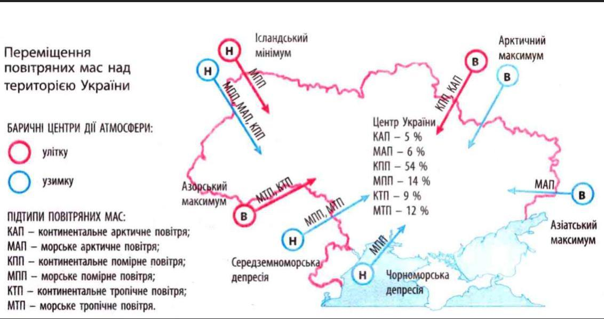
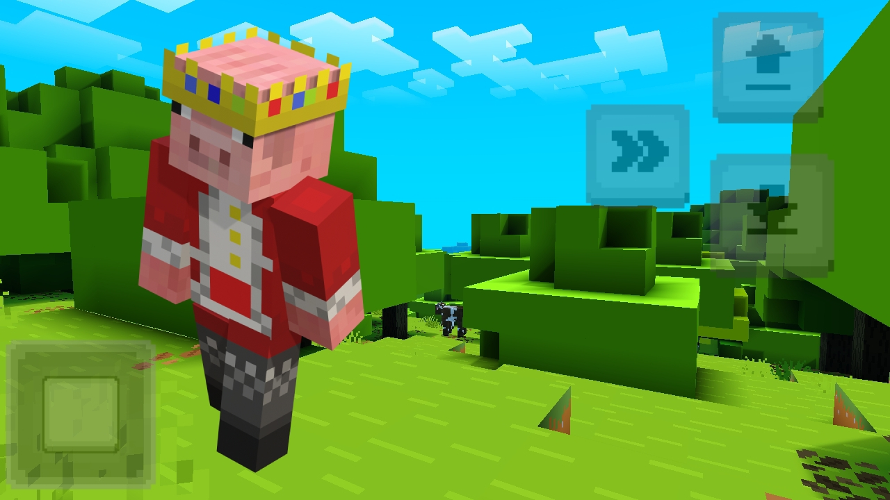
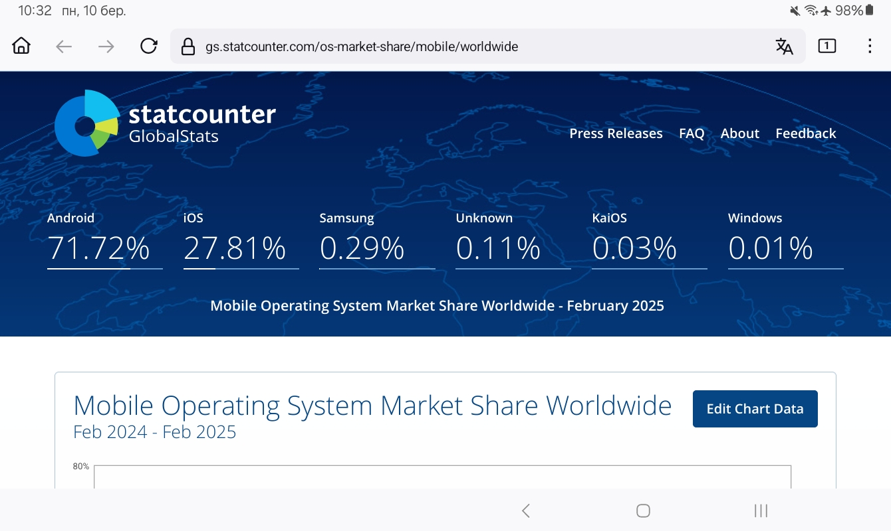
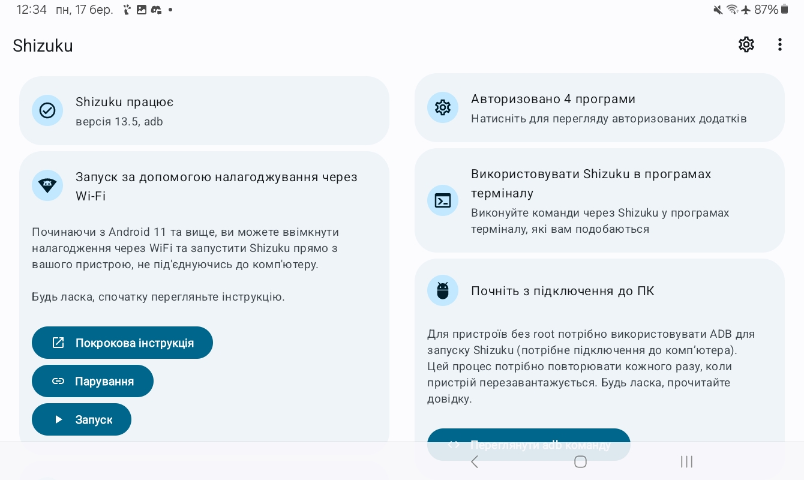
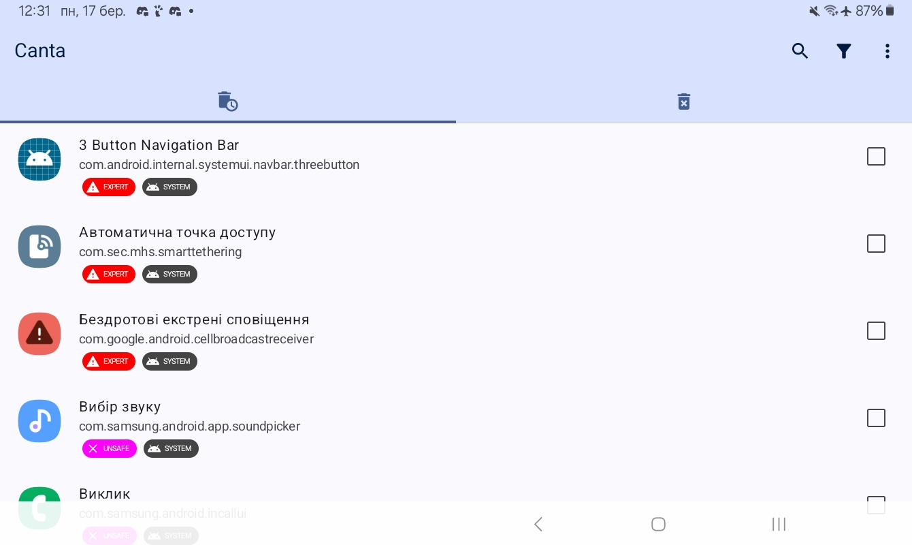
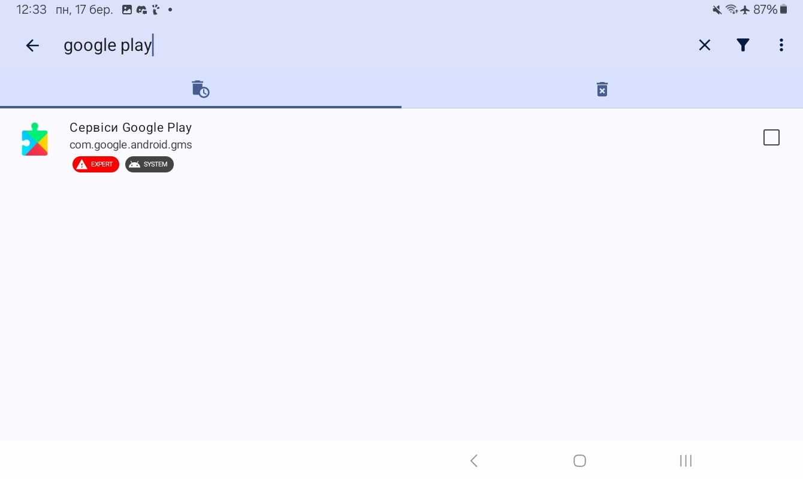
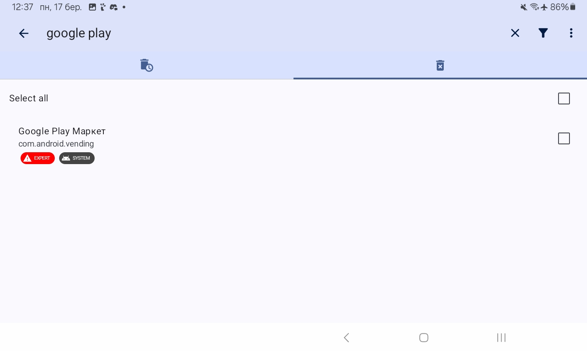

# Нова моя збірка
[Нова моя збірка](https://github.com/uzvarUA/uzvarUA/releases/download/forestryNPCnumber42-26.0.3/forestryNPCnumber42_26.0.2.mcaddon)
# Мій секрет
[APLOK GUNS](https://github.com/uzvarUA/secret/releases/download/v1.0.0/Secret-v1.0.0.mcaddon)
# Для опису YouTube
```
НЕ ОФІЦІЙНИЙ MINECRAFT [ВІДЕО]. НЕ ЗАТВЕРДЖЕНО АБО НЕ ПОВ’ЯЗАНО З MOJANG АБО MICROSOFT

pe-world: https://play.google.com/store/apps/details?id=peworld.launcher
Відео про Minecraft Bedrock Edition, як німе кіно, авторства каналу "Узвар" надається за ліцензією Creative Commons CC BY 4.0.

Джерело: https://www.youtube.com/@uzvar_ua

Завантажити тут: https://linktr.ee/minecraft_bedrock
Стримінг: https://t.me/uzvar_ua_live?livestream
Біблія - OSINT: https://t.me/bible_osint_ua
Telegram: https://t.me/uzvarua
Shizuku: https://shizuku.rikka.app/download/
Planet Minecraft: https://www.planetminecraft.com/project/forestry-npc-number-42/
LSpath: https://github.com/LSPosed/LSPatch
Lucky Patcher: https://www.luckypatchers.com/download/
Лісництво NPC номер 42: https://linktr.ee/Forestry_NPC_number_42
Clone Minecraft Bedrock Edition: https://linktr.ee/cloneminecraftbedrockedition

© Мої облікові записи: 
Я у Mastodon -  https://masto.ink/@uzvar
My Little Pony: Love: https://t.me/mylittleponylove_ua

Мій стікерпак-мерч: https://t.me/addstickers/zeqamerch

IP: Zeqa.net
Port 19132

Завантажити із GitHub:  https://github.com/uzvarUA/uzvarUA.github.io/releases

Addoncraft: https://github.com/uzvarUA/Addoncraft/releases
Xda forums: https://xdaforums.com/m/uzvar_ua.12700623/


Прошивка Sumsung: https://linktr.ee/uzvar


Мій Xbox:
Нік: RobyIvanov62

Петиція проти репаків gpg4win: https://chng.it/Gc6tsrYrvH

Мій Network ID:
e4da7455b244db63 (Резерв)
Window 10 Home: https://sites.google.com/view/windows-10-home-scrcpy

IP: Uzvarua.aternos.me
port: 56773
Тільки для Minecraft Bedrock edition (PE)

Мої посилання:
Robbyivashx8UA: https://bit.ly/m/Robbyivashx8UA
linktree: https://linktr.ee/robby.ivash.x8
PEWORLD: https://www.guilded.gg/r/zzWEr8pKZR?i=mM6ML6rA
Завантажити ZeroTier One із 4pda: 
https://4pda.to/forum/index.php?showtopic=986276
Сценарій: https://www.guilded.gg/r/zz4R5aYNkR?i=mM6ML6rA (Резерв)
Сценарій: https://discord.gg/MFf6QwFjNZ
Uzvar_ua: 
https://www.guilded.gg/u/uzvarua

Minecraft Patched: https://www.mediafire.com/folder/4xah1u3oylpva/Minecraft+Patched

_Для прямих ефірів я використовую дві програми:
xrecorder mod_: https://liteapks.com/xrecorder.html 
_overlays mod_:  https://5mod.ru/programmy/rabota/914-overlays-floating-apps-automation.html
pe-arm64-v8a-world: https://sites.google.com/view/pe-arm64-v8a-world
Діскорд: https://discord.gg/4Cfqrq9UZm

Генератор міста: https://randomall.ru/fantasy_town
Генератор ідеї: https://randomall.ru/plot


Інформація, яка може вас цікавити:
Мій пристрій (Плашшет): PIXUS_JOKER, знімаю та монтую відео тільки на ньому.
Моя програма для запису «Recorder (by Kimcy929)»
Монтую в PowerDirector (Mod)
Лаунчер Хорайзон
Моя анімація: Mine-imator
Фото редактор: GIMP

Прев'ю матеріали, які використовуються в даному відеоролику, не створені безпосередньо каналом «Узвар», взяті із сайту pixabay.com.
Pixabay License: Безкоштовно для комерційного використання. Вказівка авторства не потрібна. https://pixabay.com/ru/service/license/


Звукові ефекти беру із https://www.findsounds.com/mobile.html


CPA: https://bit.ly/45A6tI4

#Minecraft #Xbox #Minecraft #Uzvar_ua #minecraft_pe

00:00 Узвар
```

# Для себе
[PE-WORLD](https://github.com/uzvarUA/uzvarUA/releases/tag/PE-WORLD)
___
```javascript
import "peworldhello.js";
```
```javascript
import {world, system} from "@minecraft/server";
import {ActionFormData, ActionFormResponse} from "@minecraft/server-ui";

const playerIntervals = new Map();
let intervalId;

function startTracking(player) {
    if (playerIntervals.has(player.name)) {
        return;
    }

    const intervalId = system.runInterval(() => {
        const currentPosition = player.location;

        if (player.previousPosition) {
            const previousPosition = player.previousPosition;

            if (
                currentPosition.x !== previousPosition.x ||
                currentPosition.y !== previousPosition.y ||
                currentPosition.z !== previousPosition.z
            ) {
                stopTracking(player);
            }
        }

        player.previousPosition = currentPosition;
    }, 1);

    playerIntervals.set(player.name, intervalId);
}

function stopTracking(player) {
    const intervalId = playerIntervals.get(player.name);

    if (intervalId !== undefined) {
        system.clearRun(intervalId);
        playerIntervals.delete(player.name);
        delete player.previousPosition;

        const welcomeMessage = `§fХочеш грати з Модами\n Завантажити лаунчер PE-WORLD\n https://play.google.com/store/apps/details?id=peworld.launcher`;
        player.runCommandAsync(`tellraw @s {"rawtext":[{"text":"${welcomeMessage}"}]}`);

        let formMessage = "§fНайкращий лаунчер PE-WORLD§r\n";
        formMessage += "§fУ нас є моди\n\n";
        formMessage += "§fУ нас є аддони\n\n";
        formMessage += "§fУ нас є текстури і шейдери\n\n";
        formMessage += "§fhttps://play.google.com/store/apps/details?id=peworld.launcher";

        const form = new ActionFormData()
            .title("§d§lPE-WORLD")
            .body(formMessage)
            .button("Зачинити форму");
        form.show(player);
    }
}

world.afterEvents.playerSpawn.subscribe((event) => {
    const player = event.player;
    startTracking(player);
});
```
___

## Новий дроп
[Новий Дном](https://github.com/uzvarUA/forestryNPCnumber42_26.0.2/releases/tag/v26.0.2)
## 
```
💡 Завтра протягом усієї доби в усіх областях України діятимуть графіки знеструмлення обсягом від 0,5 до 2,5 черг (Лівий берег Києва). Про це повідомили в Укренерго.
💡 Завтра з 6:00 ранка до 23:5:9 в усіх областях України діятимуть графіки знеструмлення обсягом від 0,5 до 2,5 черг (Правий берег Києва). Про це повідомили в Укренерго.
💡 Завтра протягом усієї доби в усіх областях України діятимуть графіки знеструмлення обсягом від 1 до 6 черг (Вишгород). Про це повідомили в Укренерго.
```
# Промт
```
You are a professional screenwriter creating a concept for a short fantasy adventure film for AI generation. 
Create a captivating 5-scene story about a lonely medieval knight exploring a cave and encountering a massive sleeping dragon. 
The story should focus on awe, curiosity, and tension of approaching something legendary — cinematic, majestic, and non-threatening. 
For each scene, provide detailed visual descriptions for AI image generation: character appearance, lighting, environment, and camera style. 
Also, include video animation directions describing camera movement and scene transitions to turn still images into video. 
Each scene should last 5–6 seconds, focusing on visual storytelling, not complex dialogue.
```
# Аддон з піснею «Мотанка»
[Мотанка для версії Minecraft: Bedrock Edition 1.21.90](https://github.com/uzvarUA/junioreurovisiont-tv-addon-for-mcbe/releases/download/v1.0.0/Sofia_Nersesion_Motanka.mcaddon) <br>
Активувати 
```
/function motanka
```
***
- [x] [Мій зміст](#мій-зміст)
- [x] [Укренерго](https://t.me/s/Ukrenergo)
***
```bash
#!/data/data/com.termux/files/usr/bin/bash
set -euo pipefail

# UzvarUA Music Generator v1.0 🎧
# Автор: Ро́ббі

echo "🎧 UzvarUA Music Generator запускається…"
mkdir -p build/texts

# Ініціалізація файлів
echo '{ "format_version": "1.20.20",' > build/sound_definitions.json
> build/texts/uk_UA.lang

# Лічильник
count=0

# Обробка треків
for file in sounds/uzvarua/*.ogg; do
  name=$(basename "$file" .ogg)
  count=$((count + 1))

  # Додавання до sound_definitions.json
  echo "  \"uzvarua.track_$name\": {" >> build/sound_definitions.json
  echo "    \"sounds\": [" >> build/sound_definitions.json
  echo "      {" >> build/sound_definitions.json
  echo "        \"name\": \"uzvarua/$name\"," >> build/sound_definitions.json
  echo "        \"stream\": true," >> build/sound_definitions.json
  echo "        \"category\": \"record\"" >> build/sound_definitions.json
  echo "      }" >> build/sound_definitions.json
  echo "    ]" >> build/sound_definitions.json
  echo "  }," >> build/sound_definitions.json

  # Додавання до uk_UA.lang
  echo "sound.uzvarua.track_$name=🎵 $name музика" >> build/texts/uk_UA.lang
  echo "item.uzvarua.disc_$name.name=Платівка: $name" >> build/texts/uk_UA.lang
done

# Видалення останньої коми
sed -i '$ s/},/}/' build/sound_definitions.json
echo '}' >> build/sound_definitions.json

# Лог завершення
echo "✅ Згенеровано $count треків"
echo "📁 Файли створено в build/:"
echo " ├── sound_definitions.json"
echo " └── texts/uk_UA.lang"
```
***
```
povidom@suspilne.media
```
***
```bash
#!/data/data/com.termux/files/usr/bin/bash
set -euo pipefail

echo "🌐 Перевірка дзеркал Termux..."
termux-change-repo --list > mirror_list.txt

BEST=$(grep 'ok' mirror_list.txt | head -n 1 || true)

if [ -n "$BEST" ]; then
    echo "✅ Обрано: $BEST" | tee -a mirror_log.md
    echo "$BEST" > best_mirror.txt
else
    echo "❌ Не вдалося знайти стабільне дзеркало." | tee -a mirror_log.md
fi
```
***
***Зеля - чорт***. На Вокзалі требується ***застосунок Дія від 18 років***.
1. ***Відмінити застосунок Дія***, *щоб діти могли подорожувати на Дитяче Євробачення*.
***
# Німе кіно
```bash
#!/data/data/com.termux/files/usr/bin/bash
set -euo pipefail
# UzvarUA: Німе кіно з YouTube 🎬

clear
echo -e "\n🎬 \e[1mUzvarUA Silent Cinema\e[0m — перетвори будь-яке відео на ретро-шедевр\n"

command -v yt-dlp >/dev/null || {
  echo "⚠️ yt-dlp не знайдено. Встанови його через: pip install yt-dlp"
  exit 1
}

command -v ffmpeg >/dev/null 2>&1 || {
  echo "❌ ffmpeg не знайдено. Встанови його через: pkg install ffmpeg"
  exit 1
}

# 🔹 Введення URL
read -p "🔗 Встав URL відео з YouTube: " URL || {
  echo "Не вдалося прочитати"
  exit 1
}

[[ -z "$URL" ]] && {
  echo "❌ URL не може бути порожнім."
  exit 1
}

UZVARUA="input_$(date +%s).mp4"
# 🔹 Завантаження відео
echo -e "\n⬇️ Завантажую відео..."
yt-dlp -f bestvideo+bestaudio --merge-output-format mp4 -o "$UZVARUA" "$URL" || {
  echo "Не вдалося завантажити"
  exit 1
}

UZVARUA2="silent_film_$(date +%s).mp4"
# 🔹 Стилізація під німе кіно
echo -e "\n🎞️ Стилізую відео у стилі 1920-х..."
ffmpeg -i "$UZVARUA" \
-vf "format=gray, fps=16, noise=alls=20:allf=t+u, eq=contrast=1.5:brightness=0.05, vignette" \
-an "$UZVARUA2"

UZVARUA_3="silent_with_music_$(date +%s).mp4"
# 🔹 Вибір музики
echo -e "\n🎼 Обери музичний супровід:"
echo "1) Glass Chinchilla — The Mini Vandals"
echo "2) Без музики"
read -p "🎵 Введи номер: " MUSIC

if [[ "$MUSIC" == "1" ]]; then
    # 🔹 Перевірка наявності треку
    if [[ ! -f "glass_chinchilla.mp3" ]]; then
        echo -e "\n⚠️ Файл 'glass_chinchilla.mp3' не знайдено. Завантаж його вручну."
        exit 1
    fi
    echo -e "\n🎹 Додаю музичний супровід..."
    ffmpeg -i "$UZVARUA2" -i glass_chinchilla.mp3 -c:v copy -c:a aac -shortest "$UZVARUA_3"
    echo -e "\n✅ Готово: \e[1msilent_with_music.mp4\e[0m"
else
    echo -e "\n✅ Готово: \e[1msilent_film.mp4\e[0m"
fi

# 🔹 Додавання субтитрів
echo -e "\n📝 Хочеш додати субтитри до відео?"
echo "1) Так, вбудувати (завжди видно)"
echo "2) Так, як окремий потік (можна вимкнути)"
echo "3) Ні, без субтитрів"
read -p "📺 Введи номер: " SUBMODE

if [[ "$SUBMODE" == "1" || "$SUBMODE" == "2" ]]; then
    echo -e "\n🔍 Шукаю субтитри..."
    yt-dlp --write-auto-subs --skip-download --sub-lang "uk,en" --convert-subs srt "$URL"
    SUB=$(find . -iname "*$(yt-dlp --get-id "$URL")*.srt" | head -n 1)

    if [[ -z "$SUB" ]]; then
        echo "❌ Субтитри не знайдено."
    else
        FINAL="silent_final_$(date +%s).mp4"
        if [[ "$SUBMODE" == "1" ]]; then
            echo -e "\n📽️ Вбудовую субтитри..."
            ffmpeg -i "$UZVARUA_3" -vf "subtitles=$SUB" -c:a copy "$FINAL"
        else
            echo -e "\n📦 Додаю субтитри як окремий потік..."
            ffmpeg -i "$UZVARUA_3" -i "$SUB" -c copy -c:s mov_text "$FINAL"
        fi
        echo -e "\n✅ Готово: \e[1m$FINAL\e[0m"
    fi
else
    echo -e "\n🎬 Пропускаю субтитри."
fi

# 🔚 Завершення
echo -e "\n🍵 Дякую за творчість! UzvarUA вітає тебе у світі німого кіно.\n"
```
[Завантажити Glass Chinchilla — The Mini Vandals](https://github.com/uzvarUA/termux-uzvarua/releases/download/1.0.1/glass_chinchilla.mp3)
***
# 📋 WHOIS lookup
```bash
#!/data/data/com.termux/files/usr/bin/bash
set -euo pipefail

python3 -c "import grip" 2>/dev/null || {
  echo "⚠️ Модуль grip не знайдено. Встанови його через: pip install grip"
  exit 1
}

command -v whois >/dev/null 2>&1 || {
  echo "❌ whois не знайдено. Встанови його через: pkg install whois"
  exit 1
}


# 🛡️ UzvarUA WHOIS Lookup Module
# 📦 Автор: Роббі & Copilot
# 🕒 Версія: v1.0

clear
echo -e "\n🌐 WHOIS Lookup — UzvarUA Style"
echo -e "🔍 Введи домен для аналізу (наприклад: github.com):"

read -r domain || {
  echo "Не зміг прочитати домен"
  exit 1
}

[[ -z "$domain" ]] && {
  echo "Не домен не може бути порожнім"
  exit 1
}

echo -e "\n📡 Виконується WHOIS-запит для: $domain\n"
whois_output=$(whois "$domain")

[[ -z "$whois_output" ]] && {
  echo "❌ WHOIS-запит не повернув даних"
  exit 1
}

# 🧠 Витягуємо дату створення
creation_date=$(echo "$whois_output" | grep -iE 'Creation Date:' | head -n 1 | awk '{print $NF}')

# 🧠 Функція форматування дати
format_date() {
  date -d "$1" '+%Y-%m-%d %H:%M:%S' 2>/dev/null || echo "$1"
}

# 📄 Створюємо Markdown-звіт
report="uzvar-whois-$domain.md"
{
  echo "# 🌐 WHOIS Звіт: $domain"
  echo "- 📅 Дата створення: \`$(format_date "$creation_date")\`"
  echo "- 🕵️‍♂️ Витягнуто: \`$(date '+%Y-%m-%d %H:%M:%S')\`"
  echo "- 🧰 Інструмент: UzvarUA Whois Lookup"
  echo ""
  echo "## 🔍 Повний WHOIS:"
  echo '```'
  echo "$whois_output"
  echo '```'
} > "$report"

uzvar_ua() {
  python3 -m grip "$report"
}

echo -e "\n✅ Звіт збережено у: $report"
echo -e "📖 Переглянь його у Markdown-редакторі або через \`cat $report\`\n"
uzvar_ua
```

***
# 🌐 WHOIS Звіт: aternos.org
- 📅 Дата створення: `2013-08-28 00:11:36`
- 🕵️‍♂️ Витягнуто: `2025-09-27 17:54:03`
- 🧰 Інструмент: UzvarUA Whois Lookup

## 🔍 Повний WHOIS:
```
Domain Name: aternos.org
Registry Domain ID: REDACTED
Registrar WHOIS Server: whois.registrar.internetx.com
Registrar URL: https://www.internetx.com
Updated Date: 2025-08-27T21:12:11Z
Creation Date: 2013-08-27T21:11:36Z
Registry Expiry Date: 2026-08-27T21:11:36Z
Registrar: InterNetX GmbH
Registrar IANA ID: 151
Registrar Abuse Contact Email: domain-abuse@internetx.com
Registrar Abuse Contact Phone: +49.941595590
Domain Status: clientTransferProhibited https://icann.org/epp#clientTransferProhibited
Domain Status: autoRenewPeriod https://icann.org/epp#autoRenewPeriod
Name Server: ivan.ns.cloudflare.com
Name Server: uma.ns.cloudflare.com
DNSSEC: signedDelegation
URL of the ICANN Whois Inaccuracy Complaint Form: https://icann.org/wicf/
>>> Last update of WHOIS database: 2025-09-27T14:54:01Z <<<

For more information on Whois status codes, please visit https://icann.org/epp

Terms of Use: Access to Public Interest Registry WHOIS information is provided to assist persons in determining the contents of a domain name registration record in the Public Interest Registry registry database. The data in this record is provided by Public Interest Registry for informational purposes only, and Public Interest Registry does not guarantee its accuracy. This service is intended only for query-based access. You agree that you will use this data only for lawful purposes and that, under no circumstances will you use this data to (a) allow, enable, or otherwise support the transmission by e-mail, telephone, or facsimile of mass unsolicited, commercial advertising or solicitations to entities other than the data recipient's own existing customers; or (b) enable high volume, automated, electronic processes that send queries or data to the systems of Registry Operator, a Registrar, or Identity Digital except as reasonably necessary to register domain names or modify existing registrations. All rights reserved. Public Interest Registry reserves the right to modify these terms at any time. By submitting this query, you agree to abide by this policy.  The Registrar of Record identified in this output may have an RDDS service that can be queried for additional information on how to contact the Registrant, Admin, or Tech contact of the queried domain name.
```
***
***Для себе панорама***
```bash
#!/data/data/com.termux/files/usr/bin/bash

# 🌄 UzvarUA Panorama Maker for Minecraft Bedrock
# 📅 Created: 2025-09-23
# 🧃 Branded by Robby & Copilot

set -e

WORKDIR="$HOME/UzvarPanorama"
names=(panorama_0 panorama_1 panorama_2 panorama_3 panorama_4 panorama_5)

while true; do
  clear
  echo -e "\e[1;36m━━━━━━━━━━━━━━━━━━━━━━━━━━━━━━\e[0m"
  echo -e "\e[1;35m     🌄 UzvarUA Panorama Maker\e[0m"
  echo -e "\e[1;36m━━━━━━━━━━━━━━━━━━━━━━━━━━━━━━\e[0m"
  echo -e "\e[1;32m 1️⃣ Створити панораму з JPG\e[0m"
  echo -e "\e[1;31m 2️⃣ Вийти з меню\e[0m"
  echo -e "\e[1;36m━━━━━━━━━━━━━━━━━━━━━━━━━━━━━━\e[0m"
  read -p "🔸 Виберіть дію: " choice

  case "$choice" in
    1)
      mkdir -p "$WORKDIR/textures/ui" "$WORKDIR/input"
      cd "$WORKDIR"

      command -v ffmpeg >/dev/null 2>&1 || {
        echo -e "\e[1;31m❌ ffmpeg не встановлено. Встановлюємо...\e[0m"
        pkg update && pkg install ffmpeg -y
      }

      echo -e "\e[1;33m📸 Вставте 6 .jpg зображень у $WORKDIR/input перед запуском.\e[0m"
      read -p "▶️ Натисніть Enter, коли готові..."

      i=0
      for file in input/*.png; do
        out="textures/ui/${names[$i]}.png"
        echo -e "\e[1;34m🎬 Обрізка $file → $out\e[0m"
        ffmpeg -i "$file" -vf "crop=1024:1024" "$out"
        ((i++))
      done

      # 🧠 UUID через Python
      uuidgen=$(python -c "import uuid; print(uuid.uuid4())")
      uuidgen2=$(python -c "import uuid; print(uuid.uuid4())")

      # 🧾 Створення manifest.json
      cat > manifest.json <<EOF
{
  "format_version": 2,
  "header": {
    "name": "UzvarUA Panorama",
    "description": "Custom Minecraft menu background",
    "uuid": "$uuidgen",
    "version": [1, 0, 0]
  },
  "modules": [{
    "type": "resources",
    "uuid": "$uuidgen2",
    "version": [1, 0, 0]
  }]
}
EOF

      ZIPNAME="UzvarPanorama.mcpack"
      echo -e "\e[1;32m📦 Упаковка у $ZIPNAME...\e[0m"
      zip -r "$ZIPNAME" manifest.json textures

      echo -e "\e[1;32m✅ Панорама створена: $WORKDIR/$ZIPNAME\e[0m"
      echo -e "\e[1;36m📲 Відкрийте файл через Minecraft для імпорту\e[0m"
      read -p "🔸 Натисніть Enter для повернення в меню..."
      ;;
    2)
      echo -e "\e[1;31m👋 До зустрічі, UzvarUA!\e[0m"
      break
      ;;
    *)
      echo -e "\e[1;31m⚠️ Невірний вибір. Спробуйте ще раз.\e[0m"
      sleep 1
      ;;
  esac
done
```
***
[завантажити Minecraft Bedrock Edition + Atlas Client](https://github.com/uzvarUA/minecraftbe/releases)
***
# Для створення скріншоти через Key Mapper?
[Завантажити](https://github.com/uzvarUA/uzvarUA/releases/tag/Key-mapper.1)
***
# Суспільне Євробачення 
```bash
#!/data/data/com.termux/files/usr/bin/bash

while true; do
	clear
	echo "Національний відбір Євробачення від України"
	echo "1) Live-концерт"
	echo "2) Результат голосування"
	echo "3) Вийти"
	read -p "Вибери опцію: " eurovis

	case $eurovis in
		1)
			echo -e "\n🔴 Live концерт"
			read -p "Введи RTMP сервер: " rtmp
			ffmpeg -re -i live_concert.mp4 -c copy -f flv "$rtmp"
			read -p $'\e[1;31mНатисніть Enter, щоб продовжити\e[0m'
		;;
		2)
			echo -e "\n📊 Результати голосування"
			read -p "Введи RTMP сервер: " rtmp
			ffmpeg -re -i voting_results.mp4 -c copy -f flv "$rtmp"
			read -p $'\e[1;31mНатисніть Enter, щоб продовжити\e[0m'
		;;
		3)
			echo -e "\n🎤 Дякуємо за увагу!"
			exit
		;;
		*)
			echo -e "\n⚠️ Неправильний вибір"
			read -p $'\e[1;31mНатисніть Enter, щоб спробувати ще раз\e[0m'
		;;
	esac
done
```
***
- [Продування вуха](#продування-вуха)
***
# Custom Panorama
***Arch Linux****
```bash
#!/usr/bin/env bash

# 🧪 Перевірка Python
if ! command -v python &> /dev/null; then
  echo "⚠️ Python не знайдено! Встановлюю через pacman..."
  sudo pacman -Sy --noconfirm python
fi

# 🧪 Перевірка pip
if ! command -v pip &> /dev/null; then
  echo "⚠️ pip не знайдено! Встановлюю через pacman..."
  sudo pacman -Sy --noconfirm python-pip
fi

# 🌿 Введення даних
read -p "📦 Назва паку: " packname
read -p "📝 Опис: " description
read -p "🎮 Мінімальна версія Minecraft (1,21,0 або 1 21 0): " version_raw

# 🔁 Автоформатування версії
version_clean=${version_raw// /,}
if [[ ! "$version_clean" =~ ^[0-9]+,[0-9]+,[0-9]+$ ]]; then
  echo "⚠️ Невірний формат! Використовуйте 1,21,0 або 1 21 0"
  exit 1
fi
version_json=${version_clean//,/ }

# 🆔 UUID
uuid_header=$(python -c "import uuid; print(uuid.uuid4())")
uuid_module=$(python -c "import uuid; print(uuid.uuid4())")

# 📁 Створення структури
mkdir -p UzvarManifest/textures/ui
for i in {0..5}; do
  touch UzvarManifest/textures/ui/panorama_${i}.png
done

# 📜 manifest.json
cat > UzvarManifest/manifest.json <<EOF
{
  "format_version": 2,
  "header": {
    "name": "$packname",
    "description": "$description",
    "uuid": "$uuid_header",
    "version": [1, 0, 0],
    "min_engine_version": [${version_json}]
  },
  "modules": [
    {
      "type": "resources",
      "uuid": "$uuid_module",
      "version": [1, 0, 0]
    }
  ]
}
EOF

# ✅ Завершення
echo "✅ Структура ресурс-паку створена в UzvarManifest/"
echo "📁 Включає: manifest.json + textures/ui/"
```
***
***iOS***
```baah
#!/bin/sh

# 🧪 Перевірка Python
if ! command -v python3 >/dev/null 2>&1; then
  echo "⚠️ Python3 не знайдено! Встановлюю..."
  apk add --no-cache python3 py3-pip
fi

# 🌿 Введення даних
printf "📦 Назва паку: "
read packname
printf "📝 Опис: "
read description
printf "🎮 Мінімальна версія Minecraft (1,21,0 або 1 21 0): "
read version_raw

# 🔁 Автоформатування версії
version_clean=$(echo "$version_raw" | tr ' ' ',')
if ! echo "$version_clean" | grep -Eq '^[0-9]+,[0-9]+,[0-9]+$'; then
  echo "⚠️ Невірний формат! Використовуйте 1,21,0 або 1 21 0"
  exit 1
fi
version_json=$(echo "$version_clean" | tr ',' ' ')

# 🆔 UUID
uuid_header=$(python3 -c "import uuid; print(uuid.uuid4())")
uuid_module=$(python3 -c "import uuid; print(uuid.uuid4())")

# 📁 Створення структури
mkdir -p UzvarManifest/textures/ui
for i in $(seq 0 5); do
  touch UzvarManifest/textures/ui/panorama_${i}.png
done

# 📜 manifest.json
cat > UzvarManifest/manifest.json <<EOF
{
  "format_version": 2,
  "header": {
    "name": "$packname",
    "description": "$description",
    "uuid": "$uuid_header",
    "version": [1, 0, 0],
    "min_engine_version": [${version_json}]
  },
  "modules": [
    {
      "type": "resources",
      "uuid": "$uuid_module",
      "version": [1, 0, 0]
    }
  ]
}
EOF

# ✅ Завершення
echo "✅ Структура ресурс-паку створена в UzvarManifest/"
echo "📁 Включає: manifest.json + textures/ui/"
```
***
***Android***
```bash
#!/data/data/com.termux/files/usr/bin/bash

# 🧪 Перевірка Python
if ! command -v python &> /dev/null; then
  echo "⚠️ Python не знайдено! Встановлюю..."
  pkg install python -y
fi

# 🧪 Перевірка pip3
if ! command -v pip3 &> /dev/null; then
  echo "⚠️ pip3 не знайдено! Встановлюю..."
  pkg install python-pip -y
fi

# 🌿 Введення даних
read -p "📦 Назва паку: " packname
read -p "📝 Опис: " description
read -p "🎮 Мінімальна версія Minecraft (1,21,0 або 1 21 0): " version_raw

# 🔁 Автоформатування версії
version_clean=${version_raw// /,}
if [[ ! "$version_clean" =~ ^[0-9]+,[0-9]+,[0-9]+$ ]]; then
  echo "⚠️ Невірний формат! Використовуйте 1,21,0 або 1 21 0"
  exit 1
fi
version_json=${version_clean//,/ }

# 🆔 UUID
uuid_header=$(python -c "import uuid; print(uuid.uuid4())")
uuid_module=$(python -c "import uuid; print(uuid.uuid4())")

# 📁 Створення структури
mkdir -p UzvarManifest/textures/ui
for i in {0..5}; do
  touch UzvarManifest/textures/ui/panorama_${i}.png
done

# 📜 manifest.json
cat > UzvarManifest/manifest.json <<EOF
{
  "format_version": 2,
  "header": {
    "name": "$packname",
    "description": "$description",
    "uuid": "$uuid_header",
    "version": [1, 0, 0],
    "min_engine_version": [${version_json}]
  },
  "modules": [
    {
      "type": "resources",
      "uuid": "$uuid_module",
      "version": [1, 0, 0]
    }
  ]
}
EOF

# ✅ Завершення
echo "✅ Структура ресурс-паку створена в UzvarManifest/"
echo "📁 Включає: manifest.json + textures/ui/"
```
***
Я роблю панораму за допомогою текстуру панораму **Deesse ui pack**
Ось команди: 
| Панорама 0 | Панорама 1 | Панорама 2 | Панорама 3 | Панорама 4 | Панорама 5 |
|---|---|---|---|---|---|
|`tp @s ~~~ 0 0` | `/tp @s ~~~ 90 0` | `/tp @s ~~~ 180 0` | `tp @s ~~~ 270 0` | `/tp @s ~~~ 0 -90` | `/tp @s ~~~ 0 90` |
***
```
SEED INFO
► Seed: 7904846446833094596
► Coordinates: X=119 Y=65 Z=-6272
► Version: Atlas Client 1.6.2 for Minecraft Bedrock Edition 1.21.72 or Bedrock Preview 1.110.25
```
***
```
Нова проблема: застосунок Дія на вокзалах тепер 18+. Діти не зможуть поїхати на Дитяче Євробачення 2025!
Хто приймав це рішення? Де логіка?
Діти – це наше майбутнє, найкращі таланти України. Через бюрократичні перепони вони не зможуть представити країну.
Вимагаю скасувати це обмеження!
Підтримка Суспільному Мовленню за організацію 👏
#ДитячеЄвробачення #Дія #Україна
```
***
[Завантажити Minecraft тут](https://github.com/uzvarUA/minecraftbe/releases)
***
```
SEED INFO
► Seed: 7904846446833094596
► Coordinates: X=119.173 Y=65 Z=-6271.884
► Version: Java Snapshot 25w34a or Bedrock Preview 1.21.110.25
```
***
# Мій профіль asciinema
[💼 Заходьте на asciinema і дивись OSINT в termux](https://asciinema.org/~uzvarua)
***
# Мій зміст 
* [Досьє Дональда Трампа](#досьє-дональда-трампа)
* [Зберегти](#зберегти)
* [Asciinema](#asciinema)
* [Моя збірка для Termux](#моя-збірка-для-termux)
* [Видалити обліковий запис Telegram](#видалити-обліковий-запис-telegram)
***
# Asciinema (OSINT)
[](https://asciinema.org/a/741021)
***
[](https://asciinema.org/a/740776)
***
[](https://asciinema.org/a/740755)
***
[](https://asciinema.org/a/740744)
***
1. Встановити `Iceraven Browser`
2. Встановити [EditThisCookie](https://www.editthiscookie.com/)
```bash
#!/data/data/com.termux/files/usr/bin/bash

# 📥 Запит шляху до JSON-файлу з автозаповненням
read -e -i "$HOME/instagram_cookies.json" -p "📂 Введи шлях до JSON-файлу cookies: " json_file

# 📤 Запит шляху для збереження TXT-файлу з автозаповненням
read -e -i "$HOME/cookies.txt" -p "📄 Введи шлях для збереження TXT-файлу (Netscape cookies): " output_file

# 🔍 Перевірка наявності JSON-файлу
if [ ! -f "$json_file" ]; then
    echo "❌ Файл не знайдено: $json_file"
    echo "📛 Переконайся, що cookies збережено у JSON-форматі за вказаним шляхом"
    exit 1
fi

# 🛠️ Конвертація у Netscape-формат
echo "# Netscape HTTP Cookie File" > "$output_file"

jq -r '.[] | [
  .domain,
  (if .hostOnly then "FALSE" else "TRUE" end),
  .path,
  (if .secure then "TRUE" else "FALSE" end),
  (if .session then 0 else (.expirationDate | floor) end),
  .name,
  .value
] | @tsv' "$json_file" >> "$output_file"

echo "✅ Конвертовано у Netscape-формат: $output_file"
```
***
# Унікалізація TikTok
```bash
#!/data/data/com.termux/files/usr/bin/bash

# === УНІКАЛІЗАТОР ДЛЯ TIKTOK ===
# Автор: Роббі & Copilot 🦄
# Опис: Завантаження + ffmpeg-унікалізація відео (дзеркало + фільтри)

# === ВВЕДЕННЯ URL ===
read -p "🔗 Встав TikTok-посилання для завантаження: " URL
[[ -z "$URL" ]] && echo "⚠️ URL не знайдено. Вихід." && exit 0

# === НАЛАШТУВАННЯ ===
OUTDIR="$HOME/tiktok_uniqs"
mkdir -p "$OUTDIR"

# === ПЕРЕВІРКА ІНСТРУМЕНТІВ ===
for tool in yt-dlp ffmpeg; do
  command -v $tool >/dev/null 2>&1 || {
    echo "❌ Встанови $tool: pkg install $tool"
    exit 1
  }
done

# === ЗАВАНТАЖЕННЯ ВІДЕО ===
echo "📥 Завантаження з TikTok..."
yt-dlp -f mp4 "$URL" -o "$OUTDIR/input.%(ext)s" || exit 1

INPUT="$OUTDIR/input.mp4"
OUTPUT="$OUTDIR/uniq_$(date +%s).mp4"

# === УНІКАЛІЗАЦІЯ ===
echo "🎨 Обробка відео (дзеркало + фільтри)..."
ffmpeg -i "$INPUT" \
  -vf "hflip, \
       eq=brightness=0.05:saturation=1.2, \
       scale=720:-2, \
       drawbox=x=0:y=0:w=iw:h=50:color=black@0.5:t=fill, \
       drawtext=text='@yourhandle':fontcolor=white:fontsize=24:x=10:y=10" \
  -c:a copy "$OUTPUT"

# === ЗВІТ ===
echo "✅ Унікалізоване відео збережено: $OUTPUT"
```
***
# Відео монтаж
`check-tools.sh`:
<br>
```bash
#!/data/data/com.termux/files/usr/bin/bash

# 🎨 ASCII-банер
clear
echo -e "\e[1;35m╔════════════════════════════════════╗"
echo -e "║ 🎬 Bash Відео-Монтажер v1.0       ║"
echo -e "╚════════════════════════════════════╝\e[0m"

# 📦 Перевірка інструментів
for tool in yt-dlp ffmpeg find; do
  command -v $tool >/dev/null || {
    echo "❌ Не знайдено: $tool. Встановіть через pkg або pip."
    exit 1
  }
done

# 🔗 Введення URL
read -p "🔗 Вставте URL відео: " url
[[ -z "$url" ]] && echo "❌ URL не вказано. Вихід." && exit 1

# 📥 Завантаження відео
yt-dlp -f bestvideo+bestaudio --merge-output-format mp4 "$url" -o "%(title)s.%(ext)s"

# 🧠 Визначення останнього відео
latest=$(find . -maxdepth 1 -name "*.mp4" -printf "%T@ %p\n" | sort -nr | head -n1 | cut -d' ' -f2-)
base="${latest%.*}"
output="${base}_montage.mp4"

# 🎛️ Меню трансформацій
echo -e "\n🎛️ Оберіть трансформації:"
echo "1) 🔁 Реверс"
echo "2) ✂️  Обрізка (перші 10 сек)"
echo "3) 🌒 Затемнення"
echo "4) 🖼️  Вставка логотипу"
echo "5) ✅ Все одразу"
read -p "👉 Введіть номер (можна кілька через пробіл): " choice

# ⚙️ Побудова фільтрів
filters=""
audio_filter=""
trim=""
logo="logo.png"

for opt in $choice; do
  case $opt in
    1) filters+="reverse,"; audio_filter="areverse" ;;
    2) trim="-t 10" ;;
    3) filters+="eq=brightness=-0.3," ;;
    4) if [[ -f "$logo" ]]; then
         filters+="overlay=10:10,"
       else
         echo "⚠️ Логотип $logo не знайдено. Пропускаємо."
       fi ;;
    5) filters="reverse,eq=brightness=-0.3,overlay=10:10,"; audio_filter="areverse"; trim="-t 10" ;;
  esac
done

# 🧹 Очистка фільтрів
filters="${filters%,}"

# 🧪 Побудова команди ffmpeg
cmd="ffmpeg -i \"$latest\""
[[ -n "$trim" ]] && cmd+=" $trim"
[[ -n "$filters" ]] && cmd+=" -vf \"$filters\""
[[ -n "$audio_filter" ]] && cmd+=" -af \"$audio_filter\""
cmd+=" \"$output\""

# 🚀 Виконання
echo -e "\n🚀 Виконуємо команду:"
echo "$cmd"
eval "$cmd" 2>&1 | tee "${base}_log.txt"

# ✅ Завершення
echo -e "\n✅ Готово! Збережено як: $output"
termux-open "$output"
```
1. Зберегти як `check-tools.sh`
2. `chmod +x check-tools.sh`
3. Запускаємо `./check-tools.sh`
***
# Відео Трансформатор
```bash
#!/data/data/com.termux/files/usr/bin/bash

# 🎨 Стильне ASCII-привітання
clear
echo -e "\e[1;35m╔══════════════════════════════╗"
echo -e "║ 🎬 Відео-Трансформатор v1.0 ║"
echo -e "╚══════════════════════════════╝\e[0m"

read -p "🔗 Вставте URL відео: " url
[[ -z "$url" ]] && echo "❌ URL не вказано. Вихід." && exit 1

yt-dlp -f bestvideo+bestaudio --merge-output-format mp4 "$url" -o "%(title)s.%(ext)s"
latest=$(ls -t *.mp4 | head -n1)
base="${latest%.*}"

clear
echo -e "\n🎛️ Оберіть трансформації:"
echo "1) 🔁 Реверс"
echo "2) 🌒 Затемнення"
echo "3) ✂️  Обрізка (перші 10 сек)"
echo "4) 🖼️  Вставка логотипу"
echo "5) ✅ Все одразу"
read -p "👉 Введіть номер (можна кілька через пробіл): " choice

filters=""
audio_filter=""
output="${base}_mod.mp4"

# 🧠 Обробка вибору
for opt in $choice; do
  case $opt in
    1) filters+="reverse,"; audio_filter="areverse" ;;
    2) filters+="eq=brightness=-0.3," ;;
    3) trim="-t 10" ;;
    4) logo="logo.png"
       [[ ! -f "$logo" ]] && echo "⚠️ Логотип logo.png не знайдено. Пропускаємо." || filters+="overlay=10:10," ;;
    5) filters="reverse,eq=brightness=-0.3,overlay=10:10,"; audio_filter="areverse"; trim="-t 10" ;;
  esac
done

# 🧹 Очистка фільтрів
filters="${filters%,}"

# 🧪 Побудова команди ffmpeg
cmd="ffmpeg -i \"$latest\""
[[ -n "$trim" ]] && cmd+=" $trim"
[[ -n "$filters" ]] && cmd+=" -vf \"$filters\""
[[ -n "$audio_filter" ]] && cmd+=" -af \"$audio_filter\""
cmd+=" \"$output\""

echo -e "\n🚀 Виконуємо:"
echo "$cmd"
eval "$cmd"

echo -e "\n✅ Готово! Збережено як: $output"
```
***
1. `nano video.sh` вставити це код ⬆️ і натиснути `ctrl + o`
2. Вийти `ctrl + x`
3. `chmod +x video.sh`
4. Запускаємо `./video.sh` <br>
***
[Локалізація відео](https://github.com/uzvarUA/video-localization)
***
```bash
#!/data/data/com.termux/files/usr/bin/bash

read -p "Вставте URL: " opt
[[ -z "$opt" ]] && echo "❌ URL не вказано. Вихід." && exit 1

if [[ ! "$opt" =~ ^https?://.+ ]]; then
  echo "❌ Невалідний формат URL."
  exit 1
fi

if ! git ls-remote "$opt" &> /dev/null; then
  echo "❌ Недоступний або не git-репозиторій."
  exit 1
fi

git clone "$opt"
```
___
# Унікалізація відео для Termux
```bash
#!/data/data/com.termux/files/usr/bin/bash

read -p "Ставте URL: " opt
[[ -z "$opt" ]] && echo "❌ URL не вказано. Вихід." && exit 1

BRIGHTNESS=0.7
BRIGHTNESS_FILTER=$(echo "$BRIGHTNESS - 1" | bc)

yt-dlp -f bestvideo+bestaudio --merge-output-format mp4 "$opt" -o "%(title)s.%(ext)s"
latest=$(ls -t *.mp4 | head -n1)

base="${latest%.*}"
output="${base}_dark.mp4"

echo "🎬 Обробляємо: $latest → $output з яскравістю $BRIGHTNESS_FILTER"

ffmpeg -i "$latest" \
	-map_metadata -1 \
  -vf "eq=brightness=$BRIGHTNESS_FILTER" \
  -c:a copy "$output"
```
***
```bash
#!/data/data/com.termux/files/usr/bin/bash

# 🔽 Завантаження відео з Reddit
for url in $(curl -s -H "User-agent: 'your bot 0.1'" \
  https://www.reddit.com/r/TikTokCringe/hot.json?limit=12 | \
  jq -r '.data.children[].data.url_overridden_by_dest' | \
  grep -Eo "https:\/\/v\.redd\.it\/\w{13}"); do
    yt-dlp -f bestvideo+bestaudio "$url"
done

# 🔍 Перевірка наявності відео
shopt -s nullglob
files=(*.mp4)
if [ ${#files[@]} -eq 0 ]; then
  echo "❌ Немає відео для обробки."
  exit 1
fi

# 🎞 Обробка відео
mkdir -p blur
for f in *.mp4; do
  ffmpeg -i "$f" -lavfi \
  "[0:v]scale=ih*16/9:-1,boxblur=luma_radius=min(h\,w)/20:luma_power=1:chroma_radius=min(cw\,ch)/20:chroma_power=1[bg];[bg][0:v]overlay=(W-w)/2:(H-h)/2,crop=h=iw*9/16" \
  -vb 800K "blur/$f"
done

# 🎬 Конкатенація
rm -f file_list.txt
for f in blur/*.mp4; do echo "file '$f'" >> file_list.txt ; done
ffmpeg -f concat -safe 0 -i file_list.txt -c copy final.mp4

# 🧹 Прибирання
rm -rf blur *.mp4 file_list.txt
```
***
- [Моя збірка для Termux](#моя-збірка-для-termux)
***
```bash
git clone https://github.com/uzvarUA/termux-ffmpeg && cd termux-ffmpeg && \
chmod +x uzvar_ua.sh && ./uzvar_ua.sh
```
***
```bash
#!/data/data/com.termux/files/usr/bin/bash

read -p "Ставте URL: " opt
[[ -z "$opt" ]] && echo "❌ URL не вказано. Вихід." && exit 1

BRIGHTNESS=0.7
BRIGHTNESS_FILTER=$(echo "$BRIGHTNESS - 1" | bc)

yt-dlp -f bestvideo+bestaudio --merge-output-format mp4 "$opt" -o "%(title)s.%(ext)s"
latest=$(ls -t *.mp4 | head -n1)

base="${latest%.*}"
output="${base}_dark.mp4"

echo "🎬 Обробляємо: $latest → $output з яскравістю $BRIGHTNESS_FILTER"

ffmpeg -i "$latest" \
  -vf "eq=brightness=$BRIGHTNESS_FILTER" \
  -c:a copy "$output"
```
***
```bash
#!/data/data/com.termux/files/usr/bin/bash

# Значення яскравості: 0.7 означає темніше на 30%

read -p "Ставте URL:	" opt

yt-dlp -f bestvideo+bestaudio --merge-output-format mp4 "$opt"
BRIGHTNESS=0.7

for file in *.mp4; do
  base="${file%.*}"
  output="${base}_1.mp4"

  # Обчислюємо значення для фільтра ffmpeg
  BRIGHTNESS_FILTER=$(awk "BEGIN {print $BRIGHTNESS - 1}")

  ffmpeg -i "$file" \
    -vf "eq=brightness=$BRIGHTNESS_FILTER" \
    -c:a copy "$output"
done
```
***
```bash
#!/data/data/com.termux/files/usr/bin/bash

# Значення яскравості: 0.7 означає темніше на 30%
BRIGHTNESS=0.7

for file in *.mp4; do
  base="${file%.*}"
  output="${base}_1.mp4"

  # Обчислюємо значення для фільтра ffmpeg
  BRIGHTNESS_FILTER=$(awk "BEGIN {print $BRIGHTNESS - 1}")

  ffmpeg -i "$file" \
    -vf "eq=brightness=$BRIGHTNESS_FILTER" \
    -c:a copy "$output"
done
```


***
# Моя збірка для Termux
```bash
termux-change-repo && apt update -y && apt upgrade -y && pkg install git -y && git clone https://github.com/uzvarUA/termux-uzvarua && \
cd $HOME/termux-uzvarua && chmod +x install.sh && ./install.sh
```
***Файли***
***
```bash
cd $HOME/termux-uzvarua && ./install.sh
```
***
# Встановлення пакетів
```bash
#!/data/data/com.termux/files/usr/bin/bash

clear
echo "Встановлення пакетів"
echo "1) Вибрати встановлення пакетів"
echo "2) Вийти"
read -p "Вибрати опцію: 	" uzvar
case $uzvar in
	1)
		termux-change-repo
		pkg update && pkg upgrade -y
		pkg install git -y
		pkg install proot python tur-repo -y
		pkg update
		termux-setup-storage
		pkg install thc-hydra make mandoc -y
		pkg install libjpeg-turbo libpng zlib -y
		pkg install openssl rust -y
		pkg install ffmpeg -y
		pip3 install yt-dlp
	;;
	2)
		echo " Дякую за увагу"
		exit
	;;
esac
```
***
# Eurovision UA
```bash
#!/data/data/com.termux/files/usr/bin/bash

clear
echo "Національного відбору Євробачення від України"
echo "1) Live-концерт"
echo "2) Результат Голосування "
echo "3) Вийти "
read -p  "Вибери опцію" eurovis

case $eurovis in
	1)
		echo "Live концерт"
		read -p "Введи RTMP сервер: 	" rtmp
		ffmpeg -re -i live_concert.mp4 -c copy -f flv "$rtmp"
	;;
	2)
		echo "Результати голосування"
		read -p "Ведди RTMP сервер: 	" rtmp
		ffmpeg -re -i voting_results.mp4 -c copy -f flv "$rtmp"
	;;
	3) 
		echo "Дякую за увагу!"
		exit
	;;
	*)
		echo "Неправильно"
	;;
esac
```
***
```bash
termux-change-repo
```
***
```bash
termux-setup-storage
```
***
```bash
#!/data/data/com.termux/files/usr/bin/bash

echo "🌥️ Обери тип хмар:"
select cloud in "Шарувато-дощові" "Купчасті" "Перисті" "Грозові"; do
  case $cloud in
    "Шарувато-дощові") text="Це шарувато-дощові хмари\n1. розвиваються при зміні погоди\n2. на висоті від 100 м до 1 км\n3. з них можуть випадати дощ чи мряка"; break ;;
    "Купчасті") text="Це купчасті хмари\n1. утворюються в теплу погоду\n2. мають форму ватних грудочок\n3. не приносять опадів"; break ;;
    ...
  esac
done

# Генерація зображення
magick -background lightblue -fill black -font ~/fonts/Comic_Sans_MS.ttf \
  -pointsize 24 label:"$text" cloud.png
```
***
```bash
cd $HOME/storage/shared/Documents
```
***
[🌤️ Метео-щодденик](https://github.com/uzvarUA/windy-weather-diary)
***
# Localhost (для себе)
[localhost](http://localhost:6419/)
***
```bash
termux-setup-storage
```
***
```bash
cd $HOME/storage/shared
```
***
# Видалити обліковий запис Telegram
- [Видалити обліковий запис Telegram](https://my.telegram.org/auth?to=delete)
***
Щоб встановити Grip у Termux — тобто сервер для локального перегляду Markdown-файлів у стилі GitHub — тобі знадобиться Python та pip. Ось покрокова інструкція, адаптована для Termux:

---

⚙️ Встановлення Grip у Termux

1. Онови пакети Termux
```bash
pkg update && pkg upgrade -y
```

2. Встанови Python та pip
```bash
pkg install python
```

> pip встановлюється разом із Python у Termux.

3. Встанови Grip через pip
```bash
pip install grip
```

---

🚀 Як запустити Grip

Попередній перегляд README.md:
```bash
cd /path/to/your/project
grip
```

Grip запустить локальний сервер на http://localhost:6419, який ти можеш переглянути через браузер (наприклад, у Termux з w3m, або на Android — через будь-який браузер, якщо пробросити порт).

Альтернатива: Експортувати Markdown у HTML
```bash
grip README.md --export index.html
```

Це створить HTML-файл з інлайн-стилями, який виглядає як GitHub-рендеринг.

---

🧠 Поради для Termux

- Якщо хочеш переглядати через Android-браузер, можеш пробросити порт через termux-forward або використовувати localhost у браузері, якщо Termux має доступ.
- Для перегляду HTML у Termux можна встановити w3m:
  ```bash
  pkg install w3m
  w3m index.html
  ```

---

Хочеш, я допоможу тобі зробити скрипт-ланчер для Grip з ASCII-поні або погодною темою? 🌈
***
> ⚠️ **НЕ ОФІЦІЙНИЙ ПРОДУКТ MINECRAFT. НЕ СХВАЛЕНО ТА НЕ ПОВ'ЯЗАНО З MOJANG АБО MICROSOFT.** <br>
> ⚠️ **NOT AN OFFICIAL MINECRAFT PRODUCT. NOT APPROVED BY OR ASSOCIATED WITH MOJANG OR MICROSOFT.** <br>
***

***
[04.08.2025](https://github.com/uzvarUA/04.08.2025/releases)
***
**Потрібен безкоштовний API-ключ від https://openweathermap.org/api** <br>
*Залежності:* <br>
```bash
pkg install curl jq bc -y
```
***
```bash
#!/data/data/com.termux/files/usr/bin/bash

clear
# 🔧 Введіть свій API-ключ
API_KEY="your_openweathermap_api_key"

# 🌍 Отримати координати за IP
read -p "Використати геолокацію за IP? (y/n): " use_ip
if [[ "$use_ip" == "y" ]]; then
  coords=$(curl -s https://ipinfo.io/loc)
  LAT=$(echo $coords | cut -d',' -f1)
  LON=$(echo $coords | cut -d',' -f2)
else
  read -p "Введіть широту: " LAT
  read -p "Введіть довготу: " LON
fi

# 🌡️ Отримати погодні дані
response=$(curl -s "https://api.openweathermap.org/data/2.5/weather?lat=$LAT&lon=$LON&appid=$API_KEY&units=metric")
pressure=$(echo "$response" | jq '.main.pressure')
location=$(echo "$response" | jq -r '.name')

# 📊 Аналіз тиску
echo -e "\n📍 Локація: $location"
echo "🔎 Атмосферний тиск: $pressure hPa"

if (( $(echo "$pressure > 1020" | bc -l) )); then
  echo "🟦 Ви в зоні високого тиску (антициклон) — ймовірно, ясна погода ☀️"
elif (( $(echo "$pressure < 1000" | bc -l) )); then
  echo "🟥 Ви в зоні низького тиску (циклон) — можливі опади або бурі 🌧️"
else
  echo "🟨 Тиск у межах норми — перехідна зона або фронт 🌤️"
fi
```
***
| `Windy.com`: точний прогноз з мапами вітру, дощу. Приєднуйтесь: |
|---|
| https://t.me/weatheruawindy |
***

***
```bash
#!/data/data/com.termux/files/usr/bin/bash

# Кольори
RED='\033[0;31m'
BLUE='\033[0;34m'
CYAN='\033[0;36m'
GREEN='\033[0;32m'
YELLOW='\033[1;33m'
NC='\033[0m' # No Color

# Меню
clear
echo -e "${CYAN}🌬️ Повітряні маси та центри атмосферного тиску над Україною${NC}"
echo -e "${YELLOW}Вибери категорію:${NC}"
echo "1. Центри атмосферного тиску"
echo "2. Типи повітряних мас"
echo "3. Частка мас у Центральній Україні"
echo "0. Вихід"
read -p "👉 Введи номер: " choice

case $choice in
  1)
    echo -e "${GREEN}🌀 Центри атмосферного тиску:${NC}"
    echo "- Ісландський мінімум — вологе прохолодне повітря"
    echo "- Азорський максимум — тепле морське повітря"
    echo "- Арктичний максимум — холодне арктичне повітря"
    echo "- Азіатський максимум — сухе континентальне повітря"
    echo "- Чорноморська депресія — тепле вологе повітря"
    echo "- Середземноморська депресія — нестабільне тропічне повітря"
    ;;
  2)
    echo -e "${BLUE}🌡️ Типи повітряних мас:${NC}"
    echo "- МАП: морське арктичне повітря"
    echo "- КАП: континентальне арктичне повітря"
    echo "- МПП: морське помірне повітря"
    echo "- КПП: континентальне помірне повітря"
    echo "- МТП: морське тропічне повітря"
    echo "- КТП: континентальне тропічне повітря"
    echo -e "${YELLOW}🔴 Літні потоки${NC}, ${BLUE}🔵 зимові потоки${NC} — див. карту для напрямків"
    ;;
  3)
    echo -e "${CYAN}📊 Частка повітряних мас у Центральній Україні:${NC}"
    echo "- КАП — 1%"
    echo "- МАП — 5%"
    echo "- КПП — 54%"
    echo "- МПП — 39%"
    echo "- КТП — 1%"
    ;;
  0)
    echo "👋 До зустрічі!"
    exit 0
    ;;
  *)
    echo -e "${RED}❌ Невірний вибір${NC}"
    ;;
esac
```
# Як запустити

1. Збережи скрипт у `airmassesua.sh`
2. Додай права на виконання:
   ```bash
   chmod +x airmassesua.sh
   ```
3. Запусти:
   ```bash
   ./airmassesua.sh
   ```
***
[Для Telegram](#для-telegram)
***
0. [Встановлення ffmpeg та yt-dlp](#ffmpeg-та-yt-dlp)
1. Не забудьте встановити `dos2unix`, `python` і `ffmpeg` та `yt-dlp`
2. написати `nano install.sh` і вставити цей [скрипт](#скрипт) та зберегти натисніть на клавішу `Ctrl + o` і вийти `Ctrl + x` 👇
3. `chmod +x install.sh`
4. `./install.sh` <br>
### Скрипт
```bash
#!/data/data/com.termux/files/usr/bin/bash

clear
echo -e "\e[35m╔══════════════════════════════╗"
echo -e "\e[35m║     🦄 PonyStream Launcher     ║"
echo -e "\e[35m╚══════════════════════════════╝\e[0m"
echo -e "\e[36m1. Стрім з YouTube URL"
echo "2. Зациклити стрім"
echo "3. Встановити таймер запуску"
echo "4. Вийти\e[0m"
read -p "👉 Вибери опцію: " opt

case $opt in
  1)
    read -p "🔗 Встав URL відео: " url
    read -p "📡 Введи RTMP адресу: " rtmp
    yt-dlp -f bestvideo+bestaudio --merge-output-format mp4 -o temp.mp4 "$url" &&
    ffmpeg -re -i temp.mp4 -c:v libx264 -preset fast -crf 23 -c:a aac -b:a 128k -f flv "$rtmp" &&
    rm temp.mp4
    ;;
  2)
    read -p "🔗 Встав URL відео: " url
    read -p "📡 Введи RTMP адресу: " rtmp
    yt-dlp -f bestvideo+bestaudio --merge-output-format mp4 -o temp.mp4 "$url" &&
    ffmpeg -stream_loop -1 -re -i temp.mp4 -c:v libx264 -preset fast -crf 23 -c:a aac -b:a 128k -f flv "$rtmp"
    ;;
  3)
    read -p "⏱ Затримка перед запуском (у секундах): " delay
    read -p "🔗 Встав URL відео: " url
    read -p "📡 Введи RTMP адресу: " rtmp
    echo "🕒 Очікування $delay секунд..."
    sleep "$delay"
    yt-dlp -f bestvideo+bestaudio --merge-output-format mp4 -o temp.mp4 "$url" &&
    ffmpeg -re -i temp.mp4 -c:v libx264 -preset fast -crf 23 -c:a aac -b:a 128k -f flv "$rtmp" &&
    rm temp.mp4
    ;;
  4)
    echo "👋 До зустрічі, стрімере!"
    exit
    ;;
  *)
    echo "❌ Невірна опція"
    ;;
esac
```
***
```bash
yt-dlp -f bestvideo+bestaudio --merge-output-format mp4 -o temp.mp4 "URL" &&
ffmpeg -i temp.mp4 -c:v libx264 -preset fast -crf 23 -c:a aac -b:a 128k output.mp4 &&
rm temp.mp4
```
***
# Зміст по каналу
- [Мої канали](#мої-канали)
***
# Мої канали
| Odysee | YouTube |
|---|---|
| Це мій новий канал:https://odysee.com/@uzvarua_minecraft:1 | Це мій старий канал: https://www.youtube.com/@uzvar_ua |
***
# Роблю аудіокнигу про My Little Pony: Love за допомогою ffmpeg і ttsfree.com
1. [ttsfree.com](https://ttsfree.com/)
2. **FFmpeg у Termux:** <br><br>
## ffmpeg та yt-dlp
```bash
pkg update && pkg upgrade -y
pkg install git -y
pkg install proot python tur-repo -y
pkg update
pkg install thc-hydra make mandoc -y
pkg install libjpeg-turbo libpng zlib -y
pkg install openssl rust -y
```
***
```bash
pkg install ffmpeg -y
```
***
```bash
pip3 install yt-dlp
```
***
# Для Telegram
```bash
ffmpeg -f concat -safe 0 -i list.txt \
-metadata artist="My Little Pony: Love" -acodec copy my_little_pony_love.mp3
```
***
# restream
*Ретрансляція* — це передача інформації, сигналу або контенту від одного джерела до іншого через проміжну ланку. У різних сферах це поняття має свої нюанси, але суть завжди одна: посередник приймає сигнал і передає його далі.

# Це командна магія, яка дозволяє транслювати відео з YouTube у прямому ефірі на YouTube Live через RTMP. Розберімо її по частинах:

---

🧩 Команда розбита на складові

```bash
ffmpeg -re -i "$(yt-dlp -f best --get-url https://www.youtube.com/watch?v=VIDEOID)" -c copy -f flv rtmp://a.rtmp.youtube.com/live2/STREAMKEY
```

| Компонент | Пояснення |
|-----------|-----------|
| `yt-dlp -f best --get-url https://www.youtube.com/watch?v=VIDEO_ID` | Отримує пряме посилання на найкращу якість відео з YouTube без завантаження. |
| `"$(...)"` | Вставляє отримане посилання як вхідний потік для ffmpeg. |
| `ffmpeg` | Потужний інструмент для обробки медіа. Тут він використовується для ретрансляції. |
| `-re` | Вказує ffmpeg читати вхідний потік у реальному часі (імітує live). |
| `-i` | Вхідний файл або потік (тут — YouTube-відео). |
| `-c copy` | Копіює кодеки без перекодування — швидко і без втрати якості. |
| -f flv | Вказує формат вихідного потоку — FLV, який підтримує RTMP. |
| `rtmp://a.rtmp.youtube.com/live2/STREAM_KEY` | RTMP-адреса YouTube Live + ваш ключ трансляції. |

***

# 📡 Що це робить?

Ця команда:
- бере відео з YouTube,
- передає його як live stream на ваш канал YouTube Live,
- без перекодування, у форматі FLV через RTMP.

---

# ⚠️ Важливо

- `STREAM_KEY` — це ваш особистий ключ трансляції з YouTube Studio.
- YouTube може заблокувати трансляцію, якщо відео порушує авторські права.
- `yt-dlp` має бути встановлений і доступний у PATH.
- Ця команда не створює справжній live, а лише ретранслює записане відео як live.

---
```bash
yt-dlp -f best -o - https://www.youtube.com/watch?v=VIDEO_ID | \
ffmpeg -i pipe:0 -c:v copy -c:a copy -f flv rtmp://yourserver/app/streamkey
```
***
Це потужна команда для стрімінгу відео з YouTube у реальному часі через RTMP. Ось покрокове пояснення:

---

🧩 Частина 1: yt-dlp -f best -o - https://www.youtube.com/watch?v=VIDEO_ID

Це команда для завантаження відео з YouTube:

- yt-dlp — утиліта для завантаження відео (покращена версія youtube-dl)
- -f best — вибирає найкращу доступну якість відео
- -o - — виводить відео у стандартний потік (stdout), тобто не зберігає файл, а передає далі
- https://www.youtube.com/watch?v=VIDEO_ID — посилання на відео

📤 В результаті: відео не зберігається, а передається напряму в ffmpeg.

---

🔄 Частина 2: ffmpeg -i pipe:0 -c:v copy -c:a copy -f flv rtmp://yourserver/app/streamkey

Це команда для трансляції відео через RTMP:

- ffmpeg — інструмент для обробки медіа
- -i pipe:0 — отримує вхідний потік із yt-dlp через стандартний ввід
- -c:v copy -c:a copy — копіює відео та аудіо без перекодування (швидко і без втрат якості)
- -f flv — задає формат вихідного потоку (RTMP використовує FLV-контейнер)
- rtmp://yourserver/app/streamkey — адреса RTMP-сервера, куди йде трансляція

📡 В результаті: відео з YouTube транслюється напряму на RTMP-сервер (наприклад, OBS, Twitch, YouTube Live).

---

🔧 Приклад використання

```bash
yt-dlp -f best -o - https://www.youtube.com/watch?v=dQw4w9WgXcQ | \
ffmpeg -i pipe:0 -c:v copy -c:a copy -f flv rtmp://live.twitch.tv/app/yourstreamkey
```

Це дозволяє стрімити будь-яке відео з YouTube на Twitch або іншу платформу, без збереження файлу.

***
*Заходьте на telegram канал: ["My Little Pony: Love"](https://t.me/mylittleponylove_ua)*
***
# bash-скрипт для Termux
```bash
termux-change-repo
pkg update && pkg upgrade -y
pkg install git dos2unix -y
git clone https://github.com/uzvarUA/termux-bash
cd termux-bash
dos2unix install.sh
chmod +x install.sh
./install.sh
```
***
# Як встановити hydra у Termux?
1. `termux-change-repo`
2. ```bash
   pkg update && pkg upgrade -y
   ```
3. ```bash
   pkg install tur-repo make git python -y
   ```
4. ```bash
   pkg install proot thc-hydra -y
   ```
***
# Як зробити прямий ефір в YouTube за допомогою ffmpeg і yt-dlp?
Це команда, яка транслює YouTube Live-стрім на інший RTMP-сервер (у цьому випадку — YouTube Live), використовуючи ffmpeg і yt-dlp. Ось розбір по частинах:

---

🧠 Загальна ідея
Команда бере найкращий потік з YouTube Live, отримує його пряме посилання через yt-dlp, і передає його через ffmpeg на RTMP-сервер — тобто ретранслює стрім.

---

🔍 Розбір по частинах

```bash
ffmpeg -re -i "$(yt-dlp -f best --get-url https://www.youtube.com/live/RysC5f0CzkU?si=2USGEi4NsOmCoHiT)" -c copy -f flv rtmp://b.rtmp.youtube.com/live2/Ключ
```

🛠 yt-dlp
```bash
yt-dlp -f best --get-url https://www.youtube.com/live/RysC5f0CzkU
```
- yt-dlp: інструмент для завантаження відео.
- -f best: вибирає найкращу доступну якість.
- --get-url: повертає пряме посилання на відеопотік (без завантаження).
- Результат: пряма URL-адреса потоку, яку ffmpeg використовує як вхід.

🎥 ffmpeg
```bash
ffmpeg -re -i [URL] -f flv [RTMP]
```
- -re: читає вхідний потік у реальному часі (важливо для стрімінгу).
- -i: вхідний потік — пряме посилання з yt-dlp.
- -f flv: формат вихідного потоку — FLV (стандарт для RTMP).
- rtmp://...: адреса RTMP-сервера, куди транслюється відео.

---

📡 RTMP-сервер
```bash
rtmp://b.rtmp.youtube.com/live2/Ключ
```
- Це адреса YouTube Live RTMP-сервера.
- Частина після /live2/ — це ключ трансляції, який ідентифікує стрім на вашому YouTube-акаунті.

---

⚠️ Застереження
- YouTube може заблокувати ретрансляцію, якщо вона порушує авторські права.
- Ключ трансляції має бути ваш — інакше стрім не запуститься.
- Якщо стрім захищений DRM або має обмеження, yt-dlp може не отримати пряме посилання.

---

Хочеш, я допоможу автоматизувати це в bash-меню з перевіркою ключа, статусу стріму і логами? Це можна зробити магічно 🌈
***
Holehe - це інструмент з відкритим вихідним кодом для OSINT (Open Source Intelligence), який дозволяє перевіряти, чи зареєстрована електронна адреса на різних онлайн-платформах і сервісах.

Основні можливості holehe:

**Що робить:**
- Перевіряє наявність email-адреси на понад 120 популярних сайтах та сервісах (Twitter, Instagram, GitHub, Adobe, Spotify тощо)
- Показує, де саме зареєстрована електронна пошта
- Працює швидко і не потребує API ключів для більшості перевірок

**Як працює:**
- Використовує різні методи: забуті паролі, сторінки реєстрації, API endpoints
- Аналізує відповіді сервісів, щоб визначити чи існує акаунт з такою поштою
- Надає результати у зручному форматі

**Сфери застосування:**
- Кібербезпека та розслідування
- Перевірка цифрового сліду
- OSINT дослідження
- Аудит безпеки

**Встановлення та використання:**
```bash
pip3 install holehe
holehe email@example.com
```

Важливо пам'ятати, що цей інструмент слід використовувати етично та законно, з повагою до приватності інших людей і відповідно до місцевого законодавства.
***
```
termux-change-repo
```
***
```bash
pkg install proot git -y
git clone https://github.com/Lucksi/Mr.Holmes
cd Mr.Holmes
proot -0 chmod +x install_Termux.sh
./install_Termux.sh
```
# Где зберігається:
```bash
cd $HOME/Mr.Holmes/GUI/Reports/Usernames
```
***
# Привіт!
***
[Дашборд](https://drive.google.com/drive/folders/1BtZU9cjbG-mlqe91FylDV72fjzH_Q0SO?usp=drive_link)
***

***
Я записую відео про майнкрафту БЕ, як - німе кіно. <br>
Відео виходить що вихідних о 20:00 <br><br>
Я живу у лісництві NPC номер 42.
***
[](https://youtube.com/@uzvar_ua)
***
| Мої облікові записи|
|---|
| [Моя збірка](https://github.com/uzvarUA/ForestryNPCnumber42/releases/download/forestryNPCnumber42/forestryNPCnumber42_beta.1.zip) |
| [Uzvar Live](https://t.me/uzvar_ua_live) |
| [Узвар - Майнкрафт ПЕ (Бедрок)](https://t.me/uzvarua) |
| [YouTube](https://youtube.com/@uzvar_ua) |
| [Біблія - OSINT](https://t.me/bible_osint_ua) |
***
# Termux
Оновлення пакетів
```
pkg update -y && pkg upgrade -y
```
Встановити tor:
```
pkg install tor
```
Запускаємо tor:
```
tor &
```
Щоб зупинити tor:
```
pkill tor
```
***
Ось покроковий гайд з налаштування proxychains-ng у Termux:

## Встановлення

Спочатку оновіть пакети та встановіть proxychains-ng:

```bash
pkg update && pkg upgrade
pkg install proxychains-ng
```

## Налаштування конфігурації

Відкрийте файл конфігурації для редагування:

```bash
nano $PREFIX/etc/proxychains.conf
```

Основні параметри для налаштування:

**1. Режим проксування**
Розкоментуйте один з режимів:
- `dynamic_chain` - використовує доступні проксі по черзі
- `strict_chain` - використовує всі проксі в точній послідовності
- `random_chain` - випадковий вибір проксі

**2. Налаштування проксі-серверів**
В кінці файлу знайдіть секцію `[ProxyList]` та додайте свої проксі:

```
[ProxyList]
# Приклади різних типів проксі:
socks4  127.0.0.1 9050
socks5  127.0.0.1 1080
http    proxy.example.com 8080 username password
```

**3. Додаткові опції**
- `proxy_dns` - направляє DNS-запити через проксі
- `remote_dns_subnet 224` - налаштування DNS
- `tcp_read_time_out 15000` - таймаут читання
- `tcp_connect_time_out 8000` - таймаут підключення

## Використання

Після налаштування запускайте програми через proxychains:

```bash
proxychains4 curl ifconfig.me
proxychains4 wget https://example.com
proxychains4 ssh user@server.com
```

## Перевірка роботи

Перевірте, чи працює проксі:
```bash
# Без проксі
curl ifconfig.me

# З проксі
proxychains4 curl ifconfig.me
```

IP-адреси повинні відрізнятися, що підтвердить роботу проксі.

## Поради

- Переконайтеся, що ваші проксі-сервери доступні
- Для Tor використовуйте `socks5 127.0.0.1 9050`
- Можна створити alias для зручності: `alias pc='proxychains4'`
***
Для налаштування проксі в браузері Iceraven (форк Firefox для Android) можна використати кілька підходів:

**Метод 1: Вбудовані налаштування Android**
1. Відкрийте **Налаштування** Android
2. Перейдіть до **Wi-Fi**
3. Довго натисніть на вашу мережу Wi-Fi
4. Виберіть **Змінити мережу** або **Налаштування мережі**
5. Розгорніть **Додаткові параметри**
6. Встановіть **Проксі** на **Вручну**
7. Введіть:
   - **Ім'я хоста проксі**: IP або домен
   - **Порт проксі**: номер порту
   - **Винятки**: домени без проксі (за потреби)

**Метод 2: Через about:config в Iceraven**
1. У адресному рядку введіть `about:config`
2. Знайдіть і змініть параметри:
   - `network.proxy.type` = 1 (для ручного проксі)
   - `network.proxy.http` = IP проксі
   - `network.proxy.http_port` = порт проксі
   - `network.proxy.ssl` = IP проксі (для HTTPS)
   - `network.proxy.ssl_port` = порт проксі

**Метод 3: Розширення**
1. Встановіть розширення для проксі (наприклад, FoxyProxy)
2. Налаштуйте проксі через інтерфейс розширення

**Метод 4: Використання Tor**
Якщо потрібна анонімність:
1. Встановіть Orbot
2. Налаштуйте Iceraven для роботи через Tor:
   - HTTP проксі: 127.0.0.1:8118
   - SOCKS проксі: 127.0.0.1:9050

**Перевірка роботи:**
Відвідайте сайт типу whatismyipaddress.com для перевірки зміни IP.
***
На Android 11 і вище Google посилив політику доступу до файлової системи (Scoped Storage), тому отримати повний доступ до папки /data складно. Однак є кілька способів спробувати:
# Безпека
* [URL2PNG](https://www.url2png.com/) — *дозволяє в один клік зробити знімки екрана будь-якого веб-вебсайту. Дуже зручно для перевірки сумнівних посилань, хоча від можливих редіректів (перенаправлень на інші ресурси) він не врятує, але щоб отримати загальну інформацію про те, куди веде посилання, в більшості випадків дозволить.*
* [Whocall](https://whocalld.com/) — *перевірка телефонних номерів на предмет спаму. Мета цього сайту - допомогти людям дізнатися, хто їм дзвонив. Іноді ми отримуємо дзвінки з невідомих телефонних номерів і досить часто це скам. Все ж, більше цей сервіс орієнтований на Західний сегмент.*
***
### 1. Використання `shizuku` + `MT Manager` або `Mixplorer`
- Shizuku дозволяє отримати API-доступ до системних функцій без повного root.
- MT Manager або Mixplorer (з підтримкою Shizuku) можуть переглядати системні папки.
- Кроки:
  1. Встановіть Shizuku (через ADB або root).
  2. Запустіть його і дайте дозвіл.
  3. В MT Manager або Mixplorer активуйте Shizuku-режим.
  4. Спробуйте зайти в /data.

### 2. ADB (якщо увімкнено налагодження по USB)
- Якщо у вас є доступ до ADB, можна спробувати:
  ```
  adb shell
  su
  ls /data
  ```
- Але на більшості пристроїв без root це не спрацює.

### 3. Root-доступ (Magisk)
- Найнадійніший спосіб — отримати root через Magisk.
- Після рутування:
  - Використовуйте Root Explorer, FX File Explorer або Termux з sudo.
  - Дайте застосунку root-права і відкрийте /data.

### 4. Тимчасове відключення Scoped Storage (тільки для розробників)
- В Android 10-12 можна тимчасово відключити Scoped Storage через ADB:
  ```
  adb shell sm set-isolated-storage off
  ```
- Але на Android 13+ це вже не працює.

### Висновок:
- Без root доступ до /data майже неможливий.
- З root — легко через будь-який файловий менеджер.
- ADB + Shizuku — частковий доступ, але не для всіх папок.

Якщо вам потрібно щось конкретне з /data (наприклад, backup застосунків), спробуйте Swift Backup або Neo Backup (потребують root).
***
## Зміст 
- [Файловий менеджер](#файлловий-менеджер)
- [Моя збірка](#моя-збірка)
- [Модифікація](#модифікація)
   - [Моди](#моди)
   - [Плагіни](#плагіни)
- [Новини](#новини)
- [Як створити слайд-шоу за допомогою штучного інтелекту](#як-створити-слайд-шоу-за-допомогою-штучного-інтелекту)
- [Network ID](#network-id)
- [Сід](#сід)
- [Minecraft Movie](#minecraft-movie)
- [Minecraft Movie 2](#minecraft-movie-2)
- [Minecraft Bedrock Edition](#minecraft-bedrock-edition)
- [Key Mapper](#key-mapper)
- [Ексклюзивний Крафт](#ексклюзивний-крафт)
- [Топ 10 Модів](#top-10-mods)
- [Key Mapper 2](#key-mapper-2)
- [Новини Із Лісництва NPC номер 42](#новини-із-лісництва-npc-номер-42)
- [Backups](#backups)
- [Stratumauth Backups](#stratumauth-backups)
- [Shizuku](#shizuku)
- [Forestry NPC number 42](#forestry-npc-number-42)
- [File management](#file-management)
- [Games](#games)
- [Forestry NPC number 42 mods](#forestry-npc-number-42-mods)
- [Android](#android)
- [NPC](#npc)
- [Google Play](#google-play)
- [Jami](#jami)
- [Zeqa](#zeqa)
  - [Allowed and denied client modifications](#allowed-and-denied-client-modifications)
- [Мої скіни](#my-skins)
- [Взлом Minecraft Bedrock Edition](#hacking-minecraft-bedrock-edition)
- [Зберегти](#save)
- [Шейдери](#shaders)
- [Мапа з CS 1.6](#мапа-з-cs-16)
- [Atlas Client](#atlas-client)
- [Tardis](#tardis)
  - [Інструкція про ТАРДІС](#інструкція-про-тардіс)
***
# Як проголосувати за тему?
*Ви допоможете вибрати тему*
1. Заходиш на Mastodon
2. Заходиш на профіль `@uzvar@masto.ink`
3. Завантажити застосунок [Tusky](https://tusky.app/)
***
<p xmlns:cc="http://creativecommons.org/ns#" >Ця робота ліцензована за <a href="http://creativecommons.org/licenses/by/4.0/?ref=chooser-v1" target="_blank" rel="license noopener noreferrer" style="display:inline-block;">CC BY 4.0</a></p>


# Дослідження ядерної бомби у Minecraft Bedrock Edition 
**Треба вести таку у командний блок:**
`execute as @e[type=tnt] run summon tnt`
**І поставити на затримку в циклах:** 20
| Minecraft Bedrock Edition (Затримка в циклах)  | Ядерна бомба                                        |
|------------------------------------------------|-----------------------------------------------------|
| 20                                             | "Малюк" була скинута на Хіросіму із США у 1945 р.   |
## Termux-X11 preferences
* `Display resolution mode` exact
* `Display resolution` 1280x720
* `Reseed Screen While Soft Keyboard is open` OFF
* `Fullscreen on device display` ON
* `Force Landscape orientation` ON
* `Hide display cutout` ON
* `Show additional keyboard` OFF
* `Prefer scancodes when possible` ON
## Моя збірка 
| Збірка                                                     |
|------------------------------------------------------------|
| Bonsai Addon 1.21.20+ STABLE V4.mcadon                     |
| DecoDrop V4.0 [BP 1.21.20].mcpack                          |
| DecoDrop V4.0 [RP 1.21.20].mcpack                          |
| Key Mapper .zip                                            |
| minecraft-1-21-23-01-arm64-v8a-xbox-servers-compressed.apk |
| mobileexport.mcpack                                        |
| More Camera Perspectives V-3.1.1.mcpack                    |
| Paint.mcaddon                                              |
| SafeStorage_1.21.20.mcpack                                 |
| tablist_mobile__pc.mcpack                                  |
| Копія world.mctemplate                                     |
| Копія world.mcworld                                        |
| Копія Дом для подписчиков от Компота.mctemplate            |
| Копія Дом для подписчиков от Компота.mcworld               |
***
[Завантажити збірку](https://github.com/uzvarUA/Forestry_NPC_number_42/releases/download/v1.21.23.02-minecraft-bedrock-edition.1/Forestry_NPC_number_42_v2.8.zip)
***
## Моя збірка для страшних історій
| Збірка                                                     |
|------------------------------------------------------------|
| Bonsai Addon 1.21.20+ STABLE V4.mcadon                     |
| dead_bodies_addon_v2_1732121294121.mcaddon                 |
| DecoDrop V4.0 [BP 1.21.20].mcpack                          |
| DecoDrop V4.0 [RP 1.21.20].mcpack                          |
| Key Mapper .zip                                            |
| minecraft-1-21-23-01-arm64-v8a-xbox-servers-compressed.apk |
| mobileexport.mcpack                                        |
| More Camera Perspectives V-3.1.1.mcpack                    |
| Paint.mcaddon                                              |
| SafeStorage_1.21.20.mcpack                                 |
| tablist_mobile__pc.mcpack                                  |
| Копія world.mctemplate                                     |
| Копія world.mcworld                                        |
| Копія Дом для подписчиков от Компота.mctemplate            |
| Копія Дом для подписчиков от Компота.mcworld               |
***
[Завантажити збірку для страшних історій](https://github.com/uzvarUA/Horror_stories/releases/download/v1.21.23.02-minecraft-bedrock-editiion.1/Horror_stories.zip)
***

# Як створити телепорт часу?
*Треба вводити такі команди*
1. `time @p add 1000`
2. `effect @p nausea 100 1 true`
# Сценарій
1. Побудувати телепорт міста.
2. Треба отримати командний блок `/give @s command_block`
3. Треба написати таку команду `time @p add 1000` і поставте циклічним, поставте важіль і клацніть на важіль починається міняється день і ніч.
4. У програмі `Recorder (by Kimcy929)` поставте на паузу.
5. За кадром заходиш у іншу мапу
6. За кадром написати таку команду `/effect @p nausea 100 1 true`
7. Продовжити запис у програмі `Recorder (by Kimcy929)`
# Порівняння
| Samsung Galaxy Tab A9 WiFi (Android 14.0+) | Apple             |
|--------------------------------------------|-------------------|
| Кнопка паузи є                             | Нема кнопки паузи |
***
| Версія Minecraft Bedrock Edition  |
|-----------------------------------|
| 1.21.23-реліз                     |
***
| Архітектура процесора  |
|------------------------|
| arm64-v8a |
***
*UMIG Music* — це українське музичне видавництво та продюсерська компанія, яка займається розробкою, записом і поширенням музичних творів. Вона відома своєю багаторічною історією та каталогом, що містить численні популярні пісні. UMIG Music співпрацює з багатьма українськими артистами, а також іноді представлена у міжнародних партнерствах.
***
| UMIG music |
|---|
| Артем Котенко |
| гурт "Антитіла" |
| Тарас Тополя |
| Tarabarova |
| гурт "GO_A" |
***
| Скріншоти |
|---|
| |
***
LLC "ANTYTILA" (або ТОВ "АНТИТІЛА") — це юридична особа, яка, ймовірно, є організаційною базою для діяльності українського музичного гурту "Антитіла". Такі компанії зазвичай займаються управлінням фінансових, авторських та комерційних питань, пов'язаних із творчістю гурту: продажем квитків, організацією концертів, мерчандайзингом, випуском музичних альбомів тощо.
***
*Лейбл звукозапису* (англ. record label), також фірма звукозапису, фірма грамзапису  — це бренд або торговельна марка музичних записів і музичних відео або компанія, яка ними володіє. Іноді звукозаписний лейбл також є видавничою компанією, яка керує такими брендами та торговельними марками. Фірма звукозапису є багатофункціональним підприємством, кінцевою метою діяльності якого є продаж носіїв звукозапису (раніше музичні лейбли робили ставку на фізичні носії), реалізація всього пов'язаного з роздрібним продажем музики, яку воно випускає. Це компанія, яка здійснює менеджмент музичних брендів, координує виробництво, розповсюдження та рекламу, займається координацією та деяким конторолем просування (тобто промоушну) аудіо- та іноді відеозаписів (головним чином музичні відеокліпи та відеозаписи концертів) на носіях різних відповідних форматів, серед яких вінілові платівки, компакт-касети, компакт-диски, міні-диски, SACD, DVD, та займається пошуком нових авторів музики. Такі спеціальні бізнес-структури, якими є компанії звукозапису, створюють дизайн продукту (альбому, обкладинки для компакт-дисків, вінілових платівок, касет), розробляють схеми продажів альбомів, часто навіть коректують тематику пісень, які будуть на диску, надають допомогу у виборі репертуару. Кожна фірма звукозапису займається складанням й підписанням договорів і контрактів, має контракти з виконавцями або ж права на видання записів

## Файлловий менеджер 
| Назва файлового менеджера | Опис файлового менеджера | версія android | завантажити |
|---|---|---|---|
| MiXplorer | Це швидкий файловий менеджер із простим та інтуїтивно зрозумілим інтерфейсом | Android 9.0+ | Чекаємо |
# Модифікація
## Моди 
- Чекаємо
*** 
## Плагіни
Плагін Safe Storage дозволить вам поставити потужний захист на скриню в Minecraft Bedrock Edition (PE).
| Версія Minecraft Bedrock Edition | Архітектура процесора |
|---|---|
| 1.21+ | arm64-v8a |
***
[](https://github.com/uzvarUA/uzvarUA/releases/download/v1.0.0-safe-storage/SafeStorage_1.21.30.mcpack)
# Новини
## Єдині новини
<!-- BLOG-POST-LIST:START -->
- [Все висить на волосині: чому на Полтавщині відмовляються від дизельних генераторів та як рятують область від блекауту](https://fakty.ua/466500-vse-visit-na-voloske-pochemu-na-poltavcshine-otkazyvayutsya-ot-dizelnyh-generatorov-i-chto-delayut-dlya-energonezavisimosti)
- [В Україні через негоду знеструмлено сотні населених пунктів та багатогодинні затримки поїздів](https://fakty.ua/466514-v-ukraine-iz-za-nepogody-obestocheny-sotni-naselennyh-punktov-i-mnogochasovye-zaderzhki-poezdov)
- [Бої за Донеччину загострюються: росіяни на Покровському напрямку відновлюють свої позиції](https://fakty.ua/466507-boi-za-doneckuyu-oblast-obostryayutsya-rossiyane-na-pokrovskom-napravlenii-vosstanavlivayut-svoi-pozicii)
- [«Дім — це стан душі»: українська співачка презентувала новий емоційний трек](https://fakty.ua/466482-dom-eto-sostoyanie-dushi-ukrainskaya-pevica-predstavila-novyj-emocionalnyj-trek)
- [Зеленський анонсував нові тристоронні переговори](https://fakty.ua/466510-zelenskij-anonsiroval-novye-trehstoronnie-peregovory)
<!-- BLOG-POST-LIST:END -->
# Як створити слайд-шоу за допомогою штучного інтелекту
`промпт`:
```
Привіт! Я AI артист та хочу створити короткометражний слайд-шоу. Допоможіть мені підібрати ідеї. Тому дій, як креативний копірайтер.
Тобі потрібно надати мені 5 ідей короткометражного слайд-шоу хронометражем до 5-х хвилин.
Ідеї подавай у форматі опису синопсису на 400 слів.
Ідеї слайд-шоу мають засновуватись на 2-х складових:
- Тема, що відбувається у слайд-шоу. Саме вона задає весь сюжет.
- Фотографія, або фотографії слайд-шоу. Вони мають знаходитись в центрі сюжету та просувати його в перед.
```
# Network ID
*ZeroTier One* - це аналог Hamachi (якщо хтось ще пам'ятає) під Андроїд.
| Network ID |
|---|
| 8850338390427251 |
# Сід 
| Сід | Координати |
|---|---|
| `-26441942030079747` | `/tp  568 ~ 248` |
# Як створити CSV таблицю з фільмами за допомогою ШІ?
1. `Промпт`:
```
Створи CSV таблицю з фільмами з наступними колонками: Назва фільму, рік випуску, жанр, короткий опис сюжету, рейтинг, посилання на постер, посилання на фільм на youtube каналі "Example". В таблиці повинно бути 10 фільмів.
```
2. Заходиш на сайт [Glide](https://go.glideapps.com/)
3. `New app`
4. `Import file`.
5. Готово.
***
# Termux-x11 preferences (arm64-v8a):
* `output`:
  * `Display resolution mode` exact
  * `Display resolution` 1280x720
  * `Reseed Screen While Soft Keyboard is open` OFF
  * `Fullscreen` ON
  * `Screen orientation` auto
  * `Hide display cutout` ON
* `Keyboard`:
  * `Show additional keyboard` OFF
  * `Prefer scancodes when possible` ON
***
[Завантажити](https://www.mediafire.com/folder/ztygesn99xzed/mobox)
***
*Встановити mobox:*
```bash
curl -s -o ~/x https://raw.githubusercontent.com/olegos2/mobox/main/install && . ~/x
```
***
| Пароль для `inputbridge.zip` |
|---|
| 1111 |
***
*Mobox* – емулятор windows, який дає можливість запускати вимогливі ПК гри на твоєму телефоні. Найцікавіше, що ти можеш встановити будь-яку гру, будь то відьмак, хорайзен, сталкер, гта та інші. А також необхідні програми для роботи. Сьогодні ми пройдемо шлях від встановлення необхідних програм Termux, Termux X11 та InputBridge до запуску вимогливих ігор.
# Minecraft Movie 
| Збірка |
|---|
| Realistic Crafting.mcaddon |
| Terrain_rework.mcaddon |
***
[Завантажити збірку](https://www.mediafire.com/folder/9a9im4mhv0o8e/Minecraft+Movie)
***
| Сід | Координати |
|---|---|
| -6078110404819717671 |  `-263 77 -272`
# Експерименти
- Включити всі ТВОРЦІ ДОПОВНЕНЬ.
***
[Завантажити Minecraft Bedrock Edition (PE)](https://www.mediafire.com/folder/u9mva00yzgnrk/Minecraft+Bedrock+Edition)
# Minecraft Movie 2
| Збірка |
|---|
| Minecraft Patched |
| shaders |
| BetterRenderDragon-1.4.4.zip |
| Realistic Crafting.mcaddon |
| Terrain_rework.mcaddon |
***
[Завантажити](https://www.mediafire.com/file/z78mnynykdyi6dj/Minecraft_Movie_2.zip/file)
# Minecraft Bedrock Edition 
| Збірка | Завантажити |
|---|---|
| Forestry NPC number 42 | [Minecraft Bedrock Edition (PE) v1.20.60](https://bit.ly/41mYfmu)
***
# Key Mapper
| Завантажити |
|---|
| [Key Mapper.zip](https://www.mediafire.com/file/gov4yi9uhx7ob1q/Key_Mapper_.zip/file)
# Ексклюзивний Крафт
**Читати тут**:
[Minecraft Bedrock Edition](https://github.com/uzvarUA/Minecraft-bedrock-edition)
***
| Завантажити |
|---|
| [Forestry NPC number 42 for Minecraft Bedrock Edition (PE)](https://github.com/uzvarUA/Minecraft-bedrock-edition/releases)
# Резервні копії
> [!WARNING]
> Не завантажити `My_backups.zip` - це резервні копії для себе.
****
| Не завантажити|
|---|
| [My_backups.zip](https://github.com/uzvarUA/my-backups-minecraft-pe/releases/download/v1.21.60-minecraft.1/My_backups.zip)|
# Top 10 Mods
| Топ 10 Модів, яких я користуюсь|
|---|
| Bonsai Addon |
| DecoDrop |
| LAND CLAIM |
| More Camera Perspectives |
| Paint |
| SafeStorage |
| tablist_mobile__pc |
***
[Завантажити](https://github.com/uzvarUA/uzvarUA/releases/download/v1.21.60/Forestry_NPC_number_42_v3.1.mcaddon)
***
> [!WARNING]
> [Завантажити Minecraft Bedrock Edition Patcher версії 1.21.60](https://github.com/uzvarUA/uzvarUA/releases/download/v1.21.60/84b40c60-9131-4266-a436-fa2320f630e3.apk)
> <br>
> <br>
> [Завантажити мапу](https://github.com/uzvarUA/uzvarUA/releases/download/v1.21.60/Forestry_NPC_number_42_v3.1-world.zip)
***
# Key Mapper 2
> [!WARNING]
> Тільки для Android 11+
> <br>
***
[Завантажити](https://github.com/uzvarUA/uzvarUA/releases/download/v1.21.60/Key-mapper.zip)
***
# Новини Із Лісництва NPC номер 42
> [!NOTE]
> [Читайте новин із Лісництва NPC номер 42](https://github.com/uzvarUA/News-from-Forestry-NPC-number-42)
***
# 8 Секретів Лісництва NPC Номер 42
> [!NOTE]
> [Читайте 8 Секретів Лісництва NPC Номер 42](https://github.com/uzvarUA/8-secrets-in-forestry-NPC-number-42)
***
# Forestry NPC number 42

<br><br>
**Лісництво NPC номер 42 (Forestry NPC number 42)** — це галузь **лісового господарства**, яка займається охороною, вирощуванням, раціональним використанням і відновленням лісів. <br><br>
**Лісове господарство** — це галузь економіки та науки, що займається вирощуванням, відновленням, охороною, використанням і раціональним управлінням лісами. Воно спрямоване на збереження екологічного балансу, забезпечення сталого використання лісових ресурсів і підтримку біорізноманіття.
***
# Backups
> [!WARNING]
> Не завантажити резервних копій <br>
> Резервні копії для себе
> <br>
> Версія Minecraft Bedrock Edition 1.21.60
> <br>
> [Не завантажити](https://github.com/uzvarUA/Forestry-NPC-number-backups/tree/main)
> <br>
***
# Stratumauth Backups
> [!WARNING]
> Не завантажити резервні
> <br>
> Це для себе <br>
> [Не завантажити](https://github.com/uzvarUA/stratumauth-backups/releases) <br>
***
# Shizuku
**Shizuku - це універсальна програма для Android, яка дозволяє користувачам отримати доступ до системних API без необхідності отримання кореневих прав.** <br>
Він призначений для тих, хто хоче розширити можливості свого пристрою без компрометації безпеки. <br>
Shizuku працює як посередник між системою та програмами, надаючи їм підвищені привілеї через інтерфейс ADB (Android Debug Bridge).
***
# File management
* [AirData UAV](https://play.google.com/store/apps/details?id=com.airdata.uav.app) - Drone flight analysis and fleet management platform with [access to /Android/Data](https://app.airdata.com/wiki/Help/Granting+Permissions+in+Android+13+and+14) `Proprietary`
* [Amarok-Hider](https://apt.izzysoft.de/fdroid/index/apk/deltazero.amarok.foss) - Amarok: Hide your private Files and Android APPs with just one click. `Apache-2.0` [(Source code)](https://github.com/deltazefiro/Amarok-Hider)
* [FV File Manager](https://play.google.com/store/apps/details?id=com.folderv.file) - File manager to [access Android/data and Android/obb](https://folderv.com/2023/11/24/access-Android-data-and-Android-obb-on-Android-14/) `Proprietary`
* [MiXplorer](https://xdaforums.com/t/app-2-2-mixplorer-v6-x-released-fully-featured-file-manager.1523691/#post-23109280) - File manager that can batch install APKs and access Android/data and obb using Shizuku `Proprietary`
 * [MiXplorer Silver](https://play.google.com/store/apps/details?id=com.mixplorer.silver) - Paid Google Play version of MiXplorer `Proprietary`
* [MT Manager](https://mt2.cn) - Split-screen file manager. Can install APKs and access Android/data and Android/obb using Shizuku `Proprietary`
* [NMM File Manager / Text Edit](https://play.google.com/store/apps/details?id=in.mfile) - File manager & built-in text editor `Proprietary`
* [SDMaid-SE](https://play.google.com/store/apps/details?id=eu.darken.sdmse) - SD Maid 2/SE is Android's most thorough cleaning tool `GPL-3.0` [(Source code)](https://github.com/d4rken-org/sdmaid-se)
* [SwiftBackup](https://play.google.com/store/apps/details?id=org.swiftapps.swiftbackup) `IAP` 💰 - Can backup external app files under Android/data and obb using Shizuku. Root required for full functionality `Proprietary`
* [Total Commander](https://play.google.com/store/apps/details?id=com.ghisler.android.TotalCommander) - Android port of the desktop Total Commander app (Version 3.60 beta or later) `Proprietary`
* [X-Plore](https://play.google.com/store/apps/details?id=com.lonelycatgames.Xplore) `Ads` `IAP` 💰 - File manager that can access Android/data and obb using Shizuku `Proprietary`
* [ZArchiver](https://play.google.com/store/apps/details?id=ru.zdevs.zarchiver) - Archive management program. Supports editing files <br>
***
# Games

* [90 FPS + 120 FPS & IPAD VIEW](https://play.google.com/store/apps/details?id=tq.tech.Fps) `Ads` - Enables high FPS in PUBG `Proprietary`
* [blocktopograph](https://github.com/NguyenDuck/blocktopograph) - Blocktopograph is an app server for MCBE, it includes a world, NBT editor for local worlds `AGPL-3.0`
* [HandheldExp](https://github.com/Teppichseite/HandheldExp) - In-game menu for EmulationStation (ES-DE) on Android  `MIT`
* [lac-tool](https://github.com/aliernfrog/lac-tool) - Manage maps, wallpapers, and screenshots for the game 'Los Angeles Crimes' `MIT`
* [LOModInstaller](https://github.com/anyabot/LOModInstaller) - Mod manager for the game 'Last Origin' `No license`
* [pf-tool](https://github.com/aliernfrog/pf-tool) - Easily import and share Polyfield maps `MIT`
* [PGT: GFX, Launcher & Optimizer](https://play.google.com/store/apps/details?id=inc.trilokia.pubgfxtool.free) `Ads` - Additional settings for PUBG `Proprietary`
  * [PGT+: Pro GFX, Launcher & Optimizer](https://play.google.com/store/apps/details?id=inc.trilokia.pubgfxtool) `Paid` 💰 - Additional settings for PUBG `Proprietary`
* [translatefgo](https://github.com/rayshift/translatefgo) - Fate/Grand Order game translation project `CC BY-NC-SA 4.0`
***
# Forestry NPC number 42 mods
* [Читайте у Forestry NPC number 42 mods](https://github.com/uzvarUA/Forestry-NPC-number-42-mods-)<br>
***
# Android
<br><br>
***
# NPC
## Як розмовляти з некерованим гравцем персонажем (NPC)?
**За кадром** <br><br>
1. Треба створити папку `dialogue`
2. У ній створити `назва.json`
```js
{
    "format_version": "1.21",
    "minecraft:npc_dialogue": {
        "scenes": [
            {
                "scene_tag": "open",
                "npc_name": {"rawtext":[{"text":"News"}]},
                "text": {"rawtext":[{"text":"Сьогодні новини"}]},
                "buttons": [
                    {
                        "name": {"rawtext":[{"text":"Розказати новин"}]},
						"commands": ["dialogue open @s @initiator news"]
                    }
                ]
            },
            {
                "scene_tag": "news",
                "npc_name": {"rawtext":[{"text":"News"}]},
                "text": {"rawtext":[{"text":"Сьогодні, у лісництві NPC номер 42 /n глобальне похолодання. /n Будьте  обережні!!!"}]},
                "on_close_commands": []
            }
        ]
    }
}
```
3. Виходиш із папки `dialogue`
4. Створити `manifest.json`
```js
{
	"format_version": 1.21,
	"header": {
		"description": "NPC dialogue",
		"name": "NPC dialogue",
		"uuid": "bedb705a-ec8f-458c-b5b9-d9b4fc5a3713",
		"version": [1, 0, 0]
	},
	"modules": [
		{
			"description": "NPC dialogue",
			"type": "data",
			"uuid": "f84b4dcb-7032-4af6-b870-008f2194f619",
			"version": [1, 0, 0]
		}
	]
}
```
5. Для активації треба написати таку команду: `/dialogue change @e[type=npc] open @s`<br>
***
Для зйомок я користуюсь [Release мод](https://github.com/uzvarUA/ForestryNPCnumber42)
***
# Google Play
### Як видалити Google Play для android 11 і вище?
1. Встановити `Shizuku`

2. Встановити `Canta`

3. У пошуку треба написати `Google Play`

4. У мене видалено Google Play

5. Не буде встановити ніяких застосунків у фоному режимі.
6. ⚠️ Не видалити `Сервіси Google Play (com.google.android.gms)`<br>
***
# Jami
> [!WARNING]
> Не завантажити Jami - це резервна копія <br>
> [не завантажити](https://github.com/uzvarUA/jami/releases) <br>
***
# Zeqa
```
/rules "Allowed and denied client modifications"
```
### Allowed and denied client modifications
- [x] Allowed Modifications

*The following modifications can be used on Zeqa*:

- [x] Resource packs that modify Minecraft's interface or animations
- [x] Toggle Sprint
- [x] Toggle Sneak
- [x] Full Bright (and other modifications that change your brightness/gamma)
- [x] FOV Changers (modifications that allow you to zoom in or out)
- [x] Hitbox Viewers (only those that don't allow you to see players/entities through blocks)
- [x] Capes or other cosmetics
- [x] CPS Counters
- [x] Armor HUD (modifications that display your armor and/or inventory without opening your inventory)
- [x] Auto GG (modifications that automatically send 'gg' in chat at the end of a game) <br>
***
- [ ] Categorically Denied Modifications

*Any modification or client that has any of the following features is automatically banned from Zeqa without exception*:

- [ ] Any form of hacked client
- [ ] Modifications or proxies that allow you to join Bedrock servers from the Minecraft: Java Edition client
- [ ] Auto-clickers (our full rules on input devices & mouse modifications can be found here)
- [ ] Entity radars / minimaps
- [ ] Any macros that affect gameplay - Increasing click speed / jump speed, etc.
- [ ] World or Asset Downloaders
- [ ] X-Ray (and any modification that allows you to see through blocks)
- [ ] Freelook / 360 Perspective
- [ ] No Hurt Cam
- [ ] All / Auto Sprint (modifications that allow you to sprint in all directions)
- [ ] Chat on kill (modifications that automatically send chat messages upon killing a player)
***
# My skins
* [мої скіни](https://open.skinpackmaker.com/user/@user_ooq02)
***
# Hacking Minecraft Bedrock Edition
## Android 11 і вище
1. Встановити Shizuku
2. Встановити LSPatch
3. [Завантажити](https://github.com/uzvarUA/MCBE-patched/releases)
4. Все готово! <br>
***
# Shaders
* Читатайте про [шейдерів](https://github.com/uzvarUA/shaders).
***
# Save
Детанільше: https://github.com/uzvarUA/mcbe-backups/releases
***
# Мапа з CS 1.6
Детальніше: https://github.com/uzvarua/Counter-Strike
***
# Сценарій 2
Треба отримати команди 
```
/give @p command_block
```
Треба написати
```
/tellraw @a {"rawtext":[{"text":"<Селянин>: Привіт, подорожній!"}]}
```
***
# Atlas Client
> [!Note]
> Чому я не оновлюваю Atlas Client до крайніх версій Minecraft Bedrock Edition 1.21.82? <br>
> Тому що не оновлюваю до крайніх версій Minecraft Bedrock Edition 1.21.82. Atlas Client підтримує крайню версію Minecraft Bedrock Edition 1.21.72 <br>
***
[Завантажити](https://github.com/uzvarUA/uzvarUA/releases/download/MCBE%2Batlas-client/Minecraft_Bedrock_Edition+atlas-client.zip)
***
# Tardis
```pgsql
Tardis/
├── manifest.json
├── functions/
│   ├──tardis.mcfunction
```
***
**manifest.json**
```json
{
  "format_version": 1,
  "metadata": {
    "authors": [
      "uzvarUA"
    ]
  },
  "header": {
    "name": "tardis",
    "description": "tardis",
    "min_engine_version": [
      1,
      21,
      75
    ],
    "uuid": "f8ecf88f-5306-4a87-aff9-ab7246809b6c",
    "version": [
      1,
      0,
      0
    ]
  },
  "modules": [
    {
      "type": "data",
      "uuid": "e3572df7-1946-4656-875e-f608d641a1b6",
      "version": [
        1,
        0,
        0
      ]
    }
  ]
}
```
***
**tardis.mcfunction**
```
effect @p nausea 999999 1 true
effect @p blindness 999999 1 true
effect @p night_vision 999999 1 true
title @p title §bЗакінчується
```
***
## Інструкція про ТАРДІС
1. Побудувати ТАРДІС
2. Отримати командний блок `/give @s command_block`
3. У командному блоку треба написати `funcion tardis`
4. У застосунку `AZ Screen Recorder` треба поставити на паузу
5. За кадром треба заходимо у іншому світу
6. За кадром треба побудувати ТАРДІС без командного блока і без маяка
7. У чат треба написати `/function tardis` (За кадром)
8. У застосунку `AZ Screen Recorder` треба продовжити запис
9. Готово
***
| Завантажити |
|---|
|[Tardis](https://github.com/uzvarUA/tardis/releases) |
***
# Зберегти
* https://asciinema.org/a/qVqKjoSXTOKG8ZRwBpxb5LLPc
* https://asciinema.org/a/740755
```bash
d742149f-9195-438f-8f42-5eca4d577ba9
```
***
```bash
b7d93f69-b66b-444f-ae30-4c45606c824c
```
* Зберегти в `$HOME/.config/asciinema/install-id`
***
# Asciinema
```bash
asciinema auth
```
***
```bash
asciinema rec -t "OSINT" robby.cast
```
***
```bash
asciinema stream -r
```
***
```bash
asciinema upload demo.cast
```
***
# Досьє Дональда Трампа
```
SCANNING EXECUTED ON:
Date: 16/09/2025 17:40:11
IP: 104.18.167.240
NATION: Canada
NATION-CODE: CA
REGION-CODE: ON
REGION-NAME: Ontario
CITY: Toronto
TIMEZONE: America/Toronto
ISP: Cloudflare, Inc.
ORG: Cloudflare, Inc.
AS: AS13335 Cloudflare, Inc.
LAT: 43.6532
LONG: -79.3832
ZIP/POSTAL-CODE: M5A
--------------------------------
SHOWING TWITTER RESULTS FOR: donaldjtrump.com
--------------------------------
SHOWING TWITTER RESULTS FOR: donaldjtrump
--------------------------------
SHOWING TIKTOK RESULTS FOR: donaldjtrump.com

USER FOUND: @donaldtrump.com
FOLLOWERS: 12 followers

LINK: https://tiktok.com/@donaldtrump.com

USER FOUND: @donald.trump.com
FOLLOWERS: 12 followers

LINK: https://tiktok.com/@donald.trump.com

USER FOUND: @donaldtrump.co
FOLLOWERS: 1 followers

LINK: https://tiktok.com/@donaldtrump.co

USER FOUND: @donald.trump.compt.fan
FOLLOWERS: 3 followers

LINK: https://tiktok.com/@donald.trump.compt.fan

USER FOUND: @donaldtrump_cop
FOLLOWERS: 3 followers

LINK: https://tiktok.com/@donaldtrump_cop
--------------------------------
SHOWING TIKTOK RESULTS FOR: donaldjtrump

USER FOUND: @realdonaldtrump
FOLLOWERS: 15.2M followers

LINK: https://tiktok.com/@realdonaldtrump
--------------------------------
SHOWING GITHUB RESULTS FOR: donaldjtrump.com
--------------------------------
SHOWING GITHUB RESULTS FOR: donaldjtrump

USER FOUND: donaldjtrump
PROFILE-PIC: https://avatars.githubusercontent.com/u/8404111?v=4
LINK: https://github.com/donaldjtrump

USER FOUND: Janoskovacsjohn1994
PROFILE-PIC: https://avatars.githubusercontent.com/u/198749651?v=4
LINK: https://github.com/Janoskovacsjohn1994

USER FOUND: DonaldJTrump2016
PROFILE-PIC: https://avatars.githubusercontent.com/u/84189659?v=4
LINK: https://github.com/DonaldJTrump2016

USER FOUND: HTTPS-GitHub-n
PROFILE-PIC: https://avatars.githubusercontent.com/u/131279170?v=4
LINK: https://github.com/HTTPS-GitHub-n

USER FOUND: donaldjtrumplive
PROFILE-PIC: https://avatars.githubusercontent.com/u/122757563?v=4
LINK: https://github.com/donaldjtrumplive

USER FOUND: DONALDJTRUMP779
PROFILE-PIC: https://avatars.githubusercontent.com/u/189879937?v=4
LINK: https://github.com/DONALDJTRUMP779

USER FOUND: DonaldJTrump420
PROFILE-PIC: https://avatars.githubusercontent.com/u/47987672?v=4
LINK: https://github.com/DonaldJTrump420

USER FOUND: DonaldJTrump2024
PROFILE-PIC: https://avatars.githubusercontent.com/u/88908988?v=4
LINK: https://github.com/DonaldJTrump2024

USER FOUND: DonaldJTrump2020
PROFILE-PIC: https://avatars.githubusercontent.com/u/67773134?v=4
LINK: https://github.com/DonaldJTrump2020

USER FOUND: DonaldJTrump9
PROFILE-PIC: https://avatars.githubusercontent.com/u/31213495?v=4
LINK: https://github.com/DonaldJTrump9

USER FOUND: DONALDJTRUMP666
PROFILE-PIC: https://avatars.githubusercontent.com/u/125806183?v=4
LINK: https://github.com/DONALDJTRUMP666

USER FOUND: DonaldJTrumpOfficial
PROFILE-PIC: https://avatars.githubusercontent.com/u/188909410?v=4
LINK: https://github.com/DonaldJTrumpOfficial

USER FOUND: Donaldjtrump32
PROFILE-PIC: https://avatars.githubusercontent.com/u/35814650?v=4
LINK: https://github.com/Donaldjtrump32

USER FOUND: DonaldJTrump2017
PROFILE-PIC: https://avatars.githubusercontent.com/u/33147210?v=4
LINK: https://github.com/DonaldJTrump2017

USER FOUND: donaldjtrumpfartypants
PROFILE-PIC: https://avatars.githubusercontent.com/u/23411025?v=4
LINK: https://github.com/donaldjtrumpfartypants

USER FOUND: DonaldJTrump47
PROFILE-PIC: https://avatars.githubusercontent.com/u/128853869?v=4
LINK: https://github.com/DonaldJTrump47

USER FOUND: DonaldJTrump1
PROFILE-PIC: https://avatars.githubusercontent.com/u/131284456?v=4
LINK: https://github.com/DonaldJTrump1

USER FOUND: DonaldJTrumpisgooder
PROFILE-PIC: https://avatars.githubusercontent.com/u/187436631?v=4
LINK: https://github.com/DonaldJTrumpisgooder

USER FOUND: donaldjtrumpbot
PROFILE-PIC: https://avatars.githubusercontent.com/u/20583761?v=4
LINK: https://github.com/donaldjtrumpbot

SCANNING EXECUTED WITH Mr.Holmes
```
***
```
SCANNING EXECUTED ON:

Date: 10/08/2025 08:08:53


USERNAME FOUND ON:

https://instagram.com/realDonaldTrump

https://threads.net/@realDonaldTrump

https://github.com/realDonaldTrump

https://facebook.com/realDonaldTrump

https://disqus.com/realDonaldTrump

https://pinterest.com/realDonaldTrump

https://passes.com/realDonaldTrump

https://imgur.com/user/realDonaldTrump

https://myspace.com/realDonaldTrump

https://twitch.tv/realDonaldTrump

https://www.wattpad.com/user/realDonaldTrump

https://myanimelist.net/profile/realDonaldTrump

https://vimeo.com/realDonaldTrump

https://www.deviantart.com/realDonaldTrump

https://9gag.com/u/realDonaldTrump

https://www.dailymotion.com/realDonaldTrump

https://realDonaldTrump.tumblr.com/

https://pypi.org/user/realDonaldTrump

https://about.me/realDonaldTrump

https://pokemonshowdown.com/users/realDonaldTrump

https://lolprofile.net/search/world/realDonaldTrump

https://mobile.twitter.com/realDonaldTrump

https://psnprofiles.com/realDonaldTrump

https://www.7cups.com/@realDonaldTrump

https://twitchtracker.com/realDonaldTrump

https://linktr.ee/realDonaldTrump

https://patreon.com/realDonaldTrump

https://www.buymeacoffee.com/realDonaldTrump

https://www.interpals.net/realDonaldTrump

https://tryhackme.com/p/realDonaldTrump

https://steamcommunity.com/id/realDonaldTrump

https://www.bandcamp.com/realDonaldTrump

https://www.chess.com/member/realDonaldTrump

https://freesound.org/people/realDonaldTrump

https://euw.op.gg/summoner/userName=realDonaldTrump

https://www.quora.com/profile/realDonaldTrump

https://wikipedia.org/wiki/User:realDonaldTrump

https://medium.com/@realDonaldTrump

https://pr0gramm.com/user/realDonaldTrump

https://mixcloud.com/realDonaldTrump/

https://archive.org/details/@realDonaldTrump

https://audiojungle.net/user/realDonaldTrump

https://aminoapps.com/u/realDonaldTrump

https://gitlab.com/realDonaldTrump

https://ello.co/realDonaldTrump

https://keybase.io/realDonaldTrump

https://realDonaldTrump.slack.com

https://younow.com/realDonaldTrump

https://www.smule.com/realDonaldTrump

https://www.native-instruments.com/profile/realDonaldTrump

https://buzzfeed.com/realDonaldTrump

https://osu.ppy.sh/users/realDonaldTrump

https://www.tiktok.com/@realDonaldTrump

https://www.codecademy.com/profiles/realDonaldTrump

https://themeforest.net/user/realDonaldTrump

https://www.pscp.tv/realDonaldTrump

https://api.mojang.com/users/profiles/minecraft/realDonaldTrump

https://ko-fi.com/realDonaldTrump

https://vsco.co/realDonaldTrump/gallery

https://realDonaldTrump.mymonat.com/

https://gitee.com/realDonaldTrump

https://realDonaldTrump.newgrounds.com

https://hackerone.com/realDonaldTrump

https://www.quotev.com/realDonaldTrump

https://www.bitchute.com/channel/realDonaldTrump/

https://opensea.io/realDonaldTrump

https://quizsilo.com/profile/realDonaldTrump

https://www.colourlovers.com/lover/realDonaldTrump

https://www.21buttons.com/buttoner/realDonaldTrump


SCANNING EXECUTED WITH Mr.Holmes
```
***
```
@diia.gov.ua
```
***
# Продування вуха
Продування вух — це техніка, яка допомагає вирівняти тиск у середньому вусі, особливо після польотів, занурення у воду або при закладеності. Але важливо робити це обережно, щоб не пошкодити барабанну перетинку. Ось кілька безпечних способів:
***
🌀 Метод Вальсальви (найпоширеніший)
1. Затисни ніс пальцями.
2. Закрий рот.
3. Повільно видихай через ніс, не надто сильно — просто створюй тиск.
4. Маєш почути легке «клацання» — це знак, що тиск вирівнявся.

> ⚠️ Не дуй надто сильно! Це може пошкодити вухо.
***
🧘 Метод Тойнбі
1. Затисни ніс.
2. Зроби ковтальний рух (можна з водою).
3. Це також може допомогти вирівняти тиск.
***

🚨 Коли не варто продувати
- Якщо є гострий біль, гнійні виділення, перфорація барабанної перетинки — краще звернутись до ЛОРа.
- Якщо після продування стало гірше — припини і звернись до лікаря.
***
```
Зеля таке натворили на Вокзалі требується застосунок Дія від 18 років, оскільки діти немає 18 років. 1. Відминити застосунок Дія, щоб діти могли подорожувати на Дитяче Євробачення 2025 р. Зеля - чорт
Суспільне Мовлення - молодці.
Хто приймав закон, покажи листочкі, Зеля - чорт.
Діти - це наші нації.
Пісні найкращі.
Через політику Зеля не потрабить на Дитяче Євробачення 2025 р.
Зеля - чорт.
```
***
