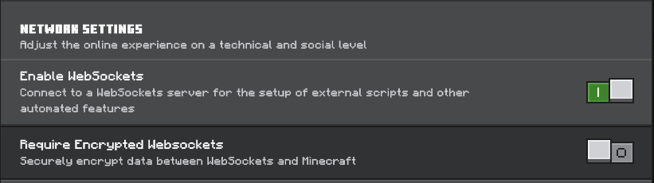

```bash
pip install python-dotenv httpx websockets==10.4 --break-system-packages
```

---

<h1 align="center" style="font-size: 2em; font-weight: bold; margin: 0;">Verity - Bedrock Edition | Гайд з налаштування</h1>

<p align="center">
  <b>Цей гайд допоможе встановити Verity - Bedrock Edition (v4.0.0)</b>
</p>

<p align="center">
  
</p>

<p align="center">
  <b>Якщо виникнуть помилки чи проблеми — можна зв’язатися через Discord, TikTok або YouTube</b>
</p>

<p align="center">
  <a href="https://discord.gg/Ngc96hZs4w"></a>
  <a href="https://tiktok.com/@pntmcvietnam"></a>
  <a href="https://youtube.com/@PnTMCvn"></a>
</p>

<p align="center">
  <b>⚠️ Відмова від відповідальності:<br> Якщо ви завантажуєте додаток чи файли з неофіційних джерел, автор не несе відповідальності за баги, конфлікти чи ризики безпеки.</b>
</p>

---

## ⬇️ Завантаження

Завантажити Verity - Bedrock Edition (v4.0.0) можна з:
* [CurseForge](https://www.curseforge.com/minecraft-bedrock/addons/verity-bedrock-edition)
* [MCPEDL](https://mcpedl.com/verity-bedrock-edition/)

---

## ⚙️ Налаштування у Minecraft

Перейдіть у **Settings → General → WebSockets**  
Увімкніть `WebSockets` та вимкніть `Require Encrypted Websockets`.



---

## 📥 Встановлення

> 🎤 Голосовий чат та AI не підтримуються нативно у Minecraft Bedrock.

---

### 🤖 Android

1. Встановіть **F-Droid**, потім через нього — **Termux** та **Termux:API**.  
2. У **App Info → Battery** виберіть **Unrestricted**.  
   У **Permissions → Microphone** дозвольте доступ.  
3. Розпакуйте `verity-android-setup.zip` у папку **Download**.  
4. Відкрийте `.env` та вставте API ключі:  
   - Groq API Key: [Створити ключ](https://console.groq.com/keys)  
   - FishAudio API Key: [Створити ключ](https://fish.audio/app/api-keys/)  
   - FishAudio Models ID: [Знайти модель](https://fish.audio/app/discovery/?q=verity)  
5. Запустіть Termux і введіть команду:

```bash
termux-setup-storage
pkg update -y && pkg install -y termux-api play-audio python-pip dos2unix && mkdir -p ~/verity-android-setup && cp -a /storage/emulated/0/Download/verity-android-setup/. ~/verity-android-setup/ 2>/dev/null || cp -a /sdcard/Download/verity-android-setup/. ~/verity-android-setup/ && cd ~/verity-android-setup && dos2unix start_android.sh && chmod +x start_android.sh && pip install python-dotenv httpx websockets==10.4 --break-system-packages && bash start_android.sh
```

---
# MCBE
```
/connect 127.0.0.1:3000
```

---
# Пакет застосунки для InstallerX Revived 
| F-droid | Google Play store | Mt Manager | Komi Store (github store) |
|---|---|---|---|
| org.fdroid.fdroid | com.android.vending | bin.mt.plus | zed.rainxch.githubstore |
## інші
**PE-world** \
[PE-world](xmpp:pe-world@conference.conversations.im?join) \
**Резевр** \
[Forestry NPC number 42](xmpp:forestry-npc-number-42@conference.conversations.im?join)

---

# Зйомки
**world template** \
[World template](xmpp:world-template-mcbe@conference.conversations.im?join) \
[Release GitHub](https://github.com/uzvarUA/uzvarUA/releases/tag/ForestryNPCnumber42-filming)

---

# Seeds:
```
-5749001512426379578
```

---
**XMPP канал** \
[Minecraft Bedrock Edition Hardcore](xmpp:minecraft-bedrock-edition-hardcore@conference.conversations.im?join)

---
[завантажити](https://github.com/uzvarUA/uzvarUA/releases/tag/v1.26.30)

---
# Команди
```
/tp @s ~ ~ ~ 90 0
```

---

```
/tp @s ~ ~ ~ 0 0
```

---
```
/tp @s ~ ~ ~ -90 0
```

---
```
/tp @s ~ ~ ~ 180 0
```

---
```
/tp @s ~ ~ ~ 0 90
```

---
```
/tp @s ~ ~ ~ 0 -90
```
___
**Початок Королеви Ембер:** 
```
Королева Ембер:  
— Принцесою з Казковії колись я була… і там жила не гірше, ніж тепер.  

Нова сім’я в замку:  
— А тепер королевою ти звешся, і це ім’я лунає з уст!  

Королева Ембер:  
— У замку мене чекає нова сім’я, і в школі я навчатимусь старанно.  

Чарівний світ (голос казки):  
— Світ чарівний тепер відкриває тобі двері, казка все переверне!  

Хор (разом):  
— Королева Ембер Прекрасна!  

Королева Ембер:  
— Я не боюсь, манер достойних я навчусь.  

Хор:  
— Королева Ембер Прекрасна!  

Королева Ембер:  
— Порину у вир подій, пригод і мрій.  

Хор:  
— Королева Ембер Прекрасна!  

Королева Ембер (з надією):  
— І скоро настане мій доленосний день…  

Хор (урочисто):  
— Королева Ембер Прекрасна!
```

# Королева Ембер Прекрасна
**XMPP канал:** \
[amber-the-first@conference.conversations.im](xmpp:amber-the-first@conference.conversations.im?join)

---

# 🎬 Мовчазний Кадр

> Студія у стилі німого кіно, де кожен кадр промовляє мовою світла й тіні.

---

## 📖 Про студію
«Мовчазний Кадр» — це творче об’єднання, натхненне естетикою німого кіно.  
Ми працюємо з чорно‑білими образами, інтертитрами та атмосферою ретро, щоб оживити поетичність минулої епохи.

---

## 🎞️ Проєкти
- **Silent Frames Series** — короткі відео у стилі 1920‑х.  
- **Retro Restoration** — відновлення старих записів із сучасними інструментами.  
- **Intertitle Art** — створення титрів та графіки у стилі німого кіно.  

---

## 🌐 Контакти
**XMPP канал:** \
[silent-frame@conference.xmpp.jp](xmpp:silent-frame@conference.xmpp.jp?join) \
**XMPP канал:** \
[silent-frame@conference.talks.in.ua](xmpp:silent-frame@conference.talks.in.ua?join) \
**XMPP канал:** \
[silent-frame@conference.chatter.com.ua](xmpp:silent-frame@conference.chatter.com.ua?join)

---
